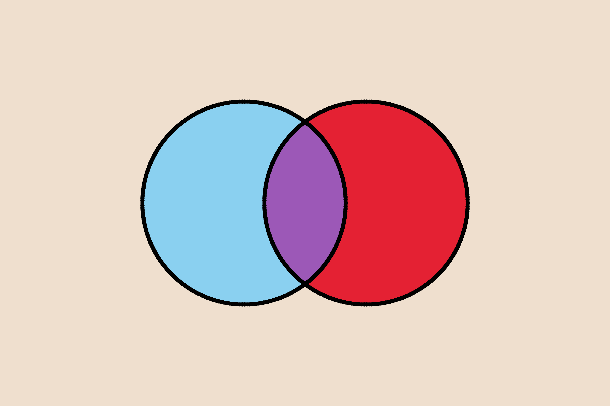
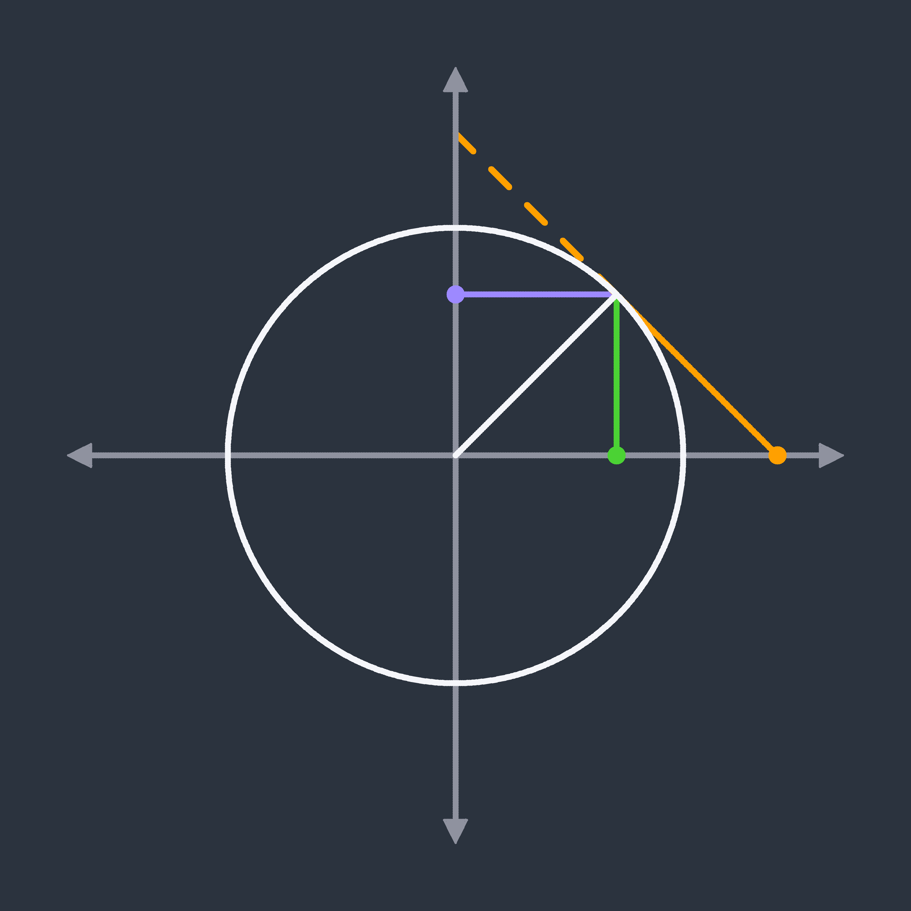
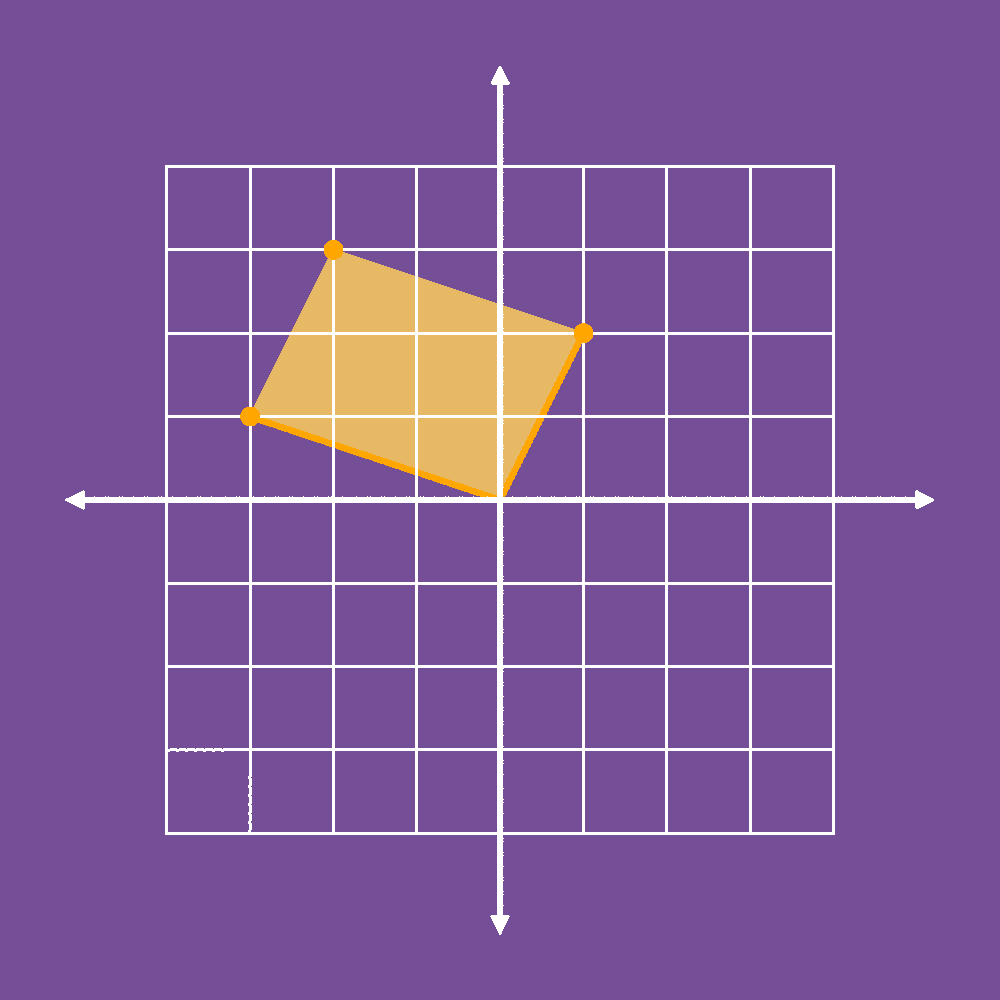

# Mathil

## Contents 

* [Introduction](#introduction)  
* [Examples](#examples)  
    * [Venn Diagram](#venn-diagram) 
    * [Geometric Representations of Trigonometric Functions](#trig-geometry)
    * [Adding Complex Numbers](#adding-complex-numbers)
* [Setup](#setup)
* [Getting Started](#getting-started)
* [Documentation](#documentation)
* [Q and A](#q-and-a)

<a name="introduction"></a>
## Introduction

Mathil is a library I have created in F# for drawing neat and consistent images that represent mathematical concepts in a programmatic way, with relatively low level control and not too much code.

<a name="examples"></a>
## Examples:

The following examples show how a few different kinds of images can be created using Mathil. Additional examples can also be found in the `examples` folder above, where they exist as functions you can call to generate the images. I have also written up a full explanation of how the code for the first image works in the ***Getting Started*** section.

<a name="venn-diagram"></a>
### Venn Diagram



```
let resolution = (3000, 2000)
let boundingBox = (createPoint (0.0, 0.0), createPoint (150.0, 100.0))
let backgroundColor = CSSColour.almond

let blankScreen = createScreen resolution boundingBox backgroundColor

let leftCircle =
    createFunction (ellipse 25.0 25.0 60.0 50.0) (0.0, 2.0 * pi)
    |> sample 900

let rightCircle =
    createFunction (ellipse 25.0 25.0 90.0 50.0) (0.0, 2.0 * pi)
    |> sample 900

let curve =
    List.empty
    |> addPointsToCurve blankScreen leftCircle CSSColour.black 10
    |> addPointsToCurve blankScreen rightCircle CSSColour.black 10

let finalScreen =
    blankScreen
    |> renderCurve RenderingType.Round curve
    |> colourFill (createPoint (75.0, 50.0)) (Colour.fromHex "#9b59b6")
    |> colourFill (createPoint (60.0, 50.0)) CSSColour.babyBlue
    |> colourFill (createPoint (90.0, 50.0)) CSSColour.alizarinCrimson

writeScreenToFile "<path to folder here>" "VennDiagram" blankScreen
```

<a name = "trig-geometry"></a>
### Geometric Representations of Trigonometric Functions



```
open System

let angle = pi / 4.0
let cos = Math.Cos(angle)
let sin = Math.Sin(angle)
let sec = 1.0 / cos
let cosec = 1.0 / sin

let resolution = (3000, 3000)
let boundingBox = (createPoint (-2.0, -2.0), createPoint (2.0, 2.0))
let backgroundColor = Colour.fromHex "#2f3640"

let blankScreen = createScreen resolution boundingBox backgroundColor

let unitCircle =
    createFunction (ellipse 1.0 1.0 0.0 0.0) (0.0, 2.0 * pi)
    |> sample 800

let radius =
    createLine (createPoint (0.0, 0.0), createPoint (cos, sin))
    |> sample 100

let sineValue =
    createLine (createPoint (cos, 0.0), createPoint (cos, sin))
    |> sample 100

let cosineValue =
    createLine (createPoint (0.0, sin), createPoint (cos, sin))
    |> sample 100

let tangentValue =
    createLine (createPoint (cos, sin), createPoint (sec, 0.0))
    |> sample 100

let tangentDashedLine =
    createDashedLine (createPoint (cos, sin), createPoint (0.0, cosec)) 5
    |> List.map (fun x -> sample 100 x)
    |> List.concat

let trigLines =
    List.empty
    |> addPointsToCurve blankScreen sineValue (Colour.fromHex "#4cd137") 10
    |> addPointsToCurve blankScreen cosineValue (Colour.fromHex "#9c88ff") 10
    |> addPointsToCurve blankScreen tangentValue CSSColour.orangePeel 10
    |> addPointsToCurve blankScreen tangentDashedLine CSSColour.orangePeel 10

let circleAndRadius =
    List.empty
    |> addPointsToCurve blankScreen unitCircle (Colour.fromHex "#f5f6fa") 10
    |> addPointsToCurve blankScreen radius (Colour.fromHex "#f5f6fa") 10


let endpoints =
    List.empty
    |> addPointsToCurve blankScreen [createPoint (cos, 0.0)] (Colour.fromHex "#4cd137") 30 // Sine
    |> addPointsToCurve blankScreen [createPoint (0.0, sin)] (Colour.fromHex "#9c88ff") 30 // Cosine
    |> addPointsToCurve blankScreen [createPoint (sec, 0.0)] CSSColour.orangePeel 30 // Tangent

let finalScreen =
    blankScreen
    |> renderCurve RenderingType.Round trigLines
    |> cartesianPlane (300, 300) 0.4 (Colour.fromHex "#8e919e") 10 4 0.1 0.1
    |> renderCurve RenderingType.Round circleAndRadius
    |> renderCurve RenderingType.Round endpoints

writeScreenToFile "<path to folder here>" "TrigGeometricRepresentation" finalScreen
```

<a name="adding-complex-numbers"></a>
### Adding Complex Numbers



```
let resolution = (3000, 3000)
let boundingBox = (createPoint (-6.0, -6.0), createPoint (6.0, 6.0))
let backgroundColour = CSSColour.darkLavender

let blankScreen = createScreen resolution boundingBox backgroundColour

let minorAxisLinesPoints =
    [
        for i in [-4..4] do
            yield
                createLine (createPoint (float i, -4.0), createPoint (float i, 4.0))
                |> sample 300

            yield
                createLine (createPoint (-4.0, float i), createPoint (4.0, float i))
                |> sample 300
    ]
    |> List.concat

let minorAxisLines =
    List.empty
    |> addPointsToCurve blankScreen minorAxisLinesPoints CSSColour.white 4

let vectorLines =
    [
        createLine (createPoint (-3.0, 1.0), createPoint (0.0, 0.0))
        createLine (createPoint (1.0, 2.0), createPoint (0.0, 0.0))
    ]
    |> List.map (fun x -> sample 100 x)
    |> List.concat

let minorParallelogramBounds =
    [
        createLine (createPoint (-3.0, 1.0), createPoint (-2.0, 3.0))
        createLine (createPoint (1.0, 2.0), createPoint (-2.0, 3.0))
    ]
    |> List.map (fun x -> sample 400 x)
    |> List.concat

let parallelogramBounds =
    List.empty
    |> addPointsToCurve blankScreen vectorLines CSSColour.orangeWebColor 10
    |> addPointsToCurve blankScreen minorParallelogramBounds (Colour.fromHex "#e7b864") 4

let complexPoints =
    List.empty
    |> addPointsToCurve blankScreen [createPoint (-3.0, 1.0)] CSSColour.orangeWebColor 30
    |> addPointsToCurve blankScreen [createPoint (1.0, 2.0)] CSSColour.orangeWebColor 30
    |> addPointsToCurve blankScreen [createPoint (-2.0, 3.0)] CSSColour.orangeWebColor 30

let finalScreen =
    blankScreen
    |> renderCurve RenderingType.Round parallelogramBounds
    |> colourFill (createPoint (-0.5, 0.5)) (Colour.fromHex "#e7b864")
    |> renderCurve RenderingType.Square minorAxisLines
    |> cartesianPlane (300, 300) 1.0 CSSColour.white 10 4 0.2 0.2
    |> renderCurve RenderingType.Round complexPoints

writeScreenToFile "<path to folder here>" "AddingComplexNumbers" finalScreen
```

<a name="setup"></a>
## Setup

The simplest way to install and use Mathil is to download the `.nupkg` file from the `package` folder from NuGet package manager by running:

```
Install-Package C:\PathToThePackageDirectory\Mathil.nupkg
```

If you are using Visual Studio you can also right click on the project, select **Manage NuGet Packages...** and specify the package source to be the folder where the `.nupkg` file is, before clicking on the package in the **Browse** tap and selecting **Install**.

If you wish to modify the source code, I have included a Visual Studio solution which includes the class library project for Mathil and a debugging console app project, which should make working with the source code easier. This is how I have been working on this project. This will also mean you can run the library without installing the `.nupkg` file.

Once you have Mathil installed or the source code available, simply add the following declarations at the top of the file and get coding!

```
open Mathil.Colours
open Mathil.MathematicalPrimitives
open Mathil.BezierCurves
open Mathil.Lines
open Mathil.Polygons
open Mathil.MathematicalConstants
open Mathil.FunctionSampling
open Mathil.Rendering
open Mathil.FileIO
open Mathil.Templates
```

<a name="getting-started"></a>
## Getting Started

To get started, here is a more thorough walkthrough of how the first example above was created.

When creating our image, we first need to decide on the resolution, bounding box and background colour, so lets set those variables, explaining them as we go.

```
let resolution = (3000, 2000)
let boundingBox = (createPoint (0.0, 0.0), createPoint (150.0, 100.0))
let backgroundColor = CSSColour.almond
```

The `resolution` will the resolution of our final image. When creating something from scratch, don't worry if you get this wrong, it's easy to change later with minimal cost.

The `bounding box` specifies the coordinates system that will be used when drawing curves and shapes. This is independent of the resolution so that you can easily set it to match what you're drawing, and so that the either can be changed after the fact without effecting the other. For example, if we wanted to draw a sine curve, I may set the bounding box to have ***x*** values just either side of -2 pi, and ***y*** values just either side of -1 and 1. Mathil will then scale your bounding box to fit your resolution. To make sure your image doesn't get stretched too much, it is recommended you call the `aspectRatios` function, will which give you the aspect ratio of the resolution and bounds in turn, so that you can see how different they are and see how much your image is stretched.

The background colour just represents the default colour we will use for our screen before we draw anything on it. In this case the `CSSColours` class has been used, which contains the colours from the CSS standard. Feel free to also use `Colour.fromRGB` or `Colour.fromHex` to customize the colours yourself.

Now we have those set, let's create our blank screen.

```
let blankScreen = createScreen resolution boundingBox backgroundColor
```

Notice that this variable is of type `Screen`. We have our screen now because we want to use its features to figure out how each other element will be rendered, but we won't actually add anything to it until the end.

Now let's create some circles for our venn diagram. When drawing a mathematical function in Mathil, we need to create something of type `Function`. Some library functions like `createBezierCurve` will do this automatically, but let's create the function ourself in this case. Looking at the definition of a function in the source code we're going to need two things, a rule and a domain.

```
type Function =
    { Rule : float -> Point; Domain : Domain }
```

A rule is just a parametric function from a float to a point. When creating a rule for yourself, you just need to create a function of that form, using `createPoint` to correctly create an instance of the `Point` type. Luckily for us though, in the library I have included some standard, common and useful functions, including one for an `ellipse`. The `ellipse` function takes 5 inputs labelled `rx ry x1 y1 t`. The first two are the radius in terms of ***x*** and ***y***, and ***(x1, y1)*** represents the centre. When we use this function we are going to curry it and leave the last input so we have a parametric function.

Given our bounding box (150.0, 100.0), I am going to choose the radius of our circle to be 50 and the location to be (60.0, 50.0), which will make our circle half the height of the image, and position it slightly offset  from the centre along our horizontal axis.

To create our function we call `createFunction`.

```
createFunction (ellipse 25.0 25.0 90.0 50.0) (0.0, 2.0 * pi)
```

The second input here is our domain, in this case we need to go from 0 to 2 pi in terms of our parameter in order to complete a full circle.

Now we want to sample that function many times in order to get a series of points which we can render. We can do that by pipelining our `Function` with the `sample` function and telling it how many times we wish to sample it. The number of samples is something worth playing around with and seeing what works after rendering the result. Let's store that as a variable called `leftCircle`.

```
let leftCircle =
    createFunction (ellipse 25.0 25.0 60.0 50.0) (0.0, 2.0 * pi)
    |> sample 900
```

Let's do the same for the right circle now, that'll be pretty similar, but just a different value for the ***x*** coordinate of the centre.

```
let rightCircle =
    createFunction (ellipse 25.0 25.0 90.0 50.0) (0.0, 2.0 * pi)
    |> sample 900
```

Next we need to convert our series of points into an instance of the `Curve` type. A curve represents a `Dot` list, where a `Dot` is the type in Mathil used to represent the object that gets rendered for a point. This means it contains extra information about the colour, the radius, and the position in terms of the pixels of the screen now, instead of the bounding box.

To do this we will create an empty list, and pipeline the adding of our points using `addPointsToCurve`.

```
let curve =
    List.empty
    |> addPointsToCurve blankScreen leftCircle CSSColour.black 10
    |> addPointsToCurve blankScreen rightCircle CSSColour.black 10
```

This `addPointsToCurve` function takes in the screen (so that it knows our resolution and bounding box), the series of points we wish to convert (in this case our two circles), the colour and the radius of each dot, which will become the line thickness, in pixels. If the ability to resize the image after the fact without disturbing the relative line thickness is important, I recommend you use the `calculateLineThickness` function and specify the thickness as a proportion of the overall image size. This means that lines will get thicker if the resolution is changed, without having to manually change them.

We're almost done now, all we need to do is render all of that to our screen and do some colour fills. Let's start by rendering the curve. To do so let's use the `renderCurve` function.

```
let finalScreen =
    blankScreen
    |> renderCurve RenderingType.Round curve
```

Just like in the case of converting our points to a `Curve`, the neatest way to do this is always to prepare the elements ahead of time, and then use the pipe operator to continually operate on the screen, rendering things in sequence. When rendering many elements, be careful about the order of rendering, so that you have things layered in the way you wish.

The `RenderingType` enum specifies whether each `Dot` is rendered as a circle or a square. In general, the option for a square should only be used with lines that are vertical and horizontal, when sharp ends are desired. For any curve, round is the way to go.

The last thing is to set some colours, for this we use the `colourFill` function, and we just need to specify a point within the solid colour we wish to fill, and the colour we want it, and this function will fill that whole region accordingly.

Instead of writing our colour fill code separately, let's just add some function calls to our pipeline for rendering.

```
let finalScreen =
    blankScreen
    |> renderCurve RenderingType.Round curve
    |> colourFill (createPoint (75.0, 50.0)) (Colour.fromHex "#9b59b6")
    |> colourFill (createPoint (60.0, 50.0)) CSSColour.babyBlue
    |> colourFill (createPoint (90.0, 50.0)) CSSColour.alizarinCrimson
```

This is another example when order of rendering is important. Without the circles to bound the colour fill, each would override the previous and change the whole image colour.

Great, we now have our image complete, the last thing to do is save it to a file by specifying the filepath and filename. Obviously I have specified the filepath to where I want it on my computer, so change this for your use case.

```
writeScreenToFile @"C:\Users\aaron\Downloads" "VennDiagram" finalScreen
```

Also note that you can add the above line to your pipline of rendering and not bother with saving the screen for the same output. Now just run your code and find your `.bmp` file wherever you specified.

If you're not happy with anything, then just go back over your code, change it and run again. If you work with high resolution images, the files produced by this library are quite large as they are uncompressed bitmaps. You can see more about this decision in the Q and A section at the bottom of this page, but in short, if you wish to use another format I recommend converting to a `.png` which will allow significantly smaller file size without a huge loss in quality (or in some cases no loss in quality), especially given a lot of the images that you may produce with this tool have big solid colours.

This is one example of something that can be done using Mathil, for full documentation on all the features of Mathil, see below.

<a name="documentation"></a>
## Documentation

I am working on thorough documentation of all the functions in this library which will be available ***here*** when complete.

<a name="q-and-a"></a>
## Q and A

#### Where does the name come from?

**Math**ematical **Il**lustrations. It was the best I could come up with...

#### Why would I use this instead of a vector drawing tool or a standard graphing calculator?

I created this to be used in place of a vector drawing tool because it more easily provides consistent results when many similar illustrations must be created, and because it allows fundamentally mathematical concepts to be illustrated from the mathematical objects themselves (parametric curves, colour mixing, etc..). In terms of graphing calculators, they are generally designed as a tool to use while solving a problem, or as an educational tool. This tool is more catered towards people looking for static illustrations to include in texts.

#### How well supported will this tool be?

As I need new features for my own purposes I will be adding them in, but I do not use this tool for my job or studying so that will be my free time only, and I make no promises about how long I will maintain it. That said, if you have ideas please create an issue and I will occasionally look to see what I can add to make it useful to others, or if you see the framework for something useful to you here but require more features, feel free to fork the repository and work on it yourself. In the meantime, I have set up a project where I will add stuff that I plan to add and stuff I am working on, which you can find [here](https://github.com/users/aaron-jack-manning/projects/13).

#### What file formats does this library produce?

All exports are 24bit, uncompressed bitmaps. This is because they are easy to read and write from keeping development and computation time down and well supported enough that they are no trouble to open, view and convert to another format easily. I have no plans to add the capability to export as other image formats.

#### Why has (insert feature) been implemented the way that it has?

I am no expert at computer graphics, and this project has been my way of learning the basics of 2D computer graphics. As such, you may find some of my implementations to be non-standard and strange, because I had serious trouble finding decent resources to understand the standard implementations of what I have done. I just did things the way that seemed most logical to me.
