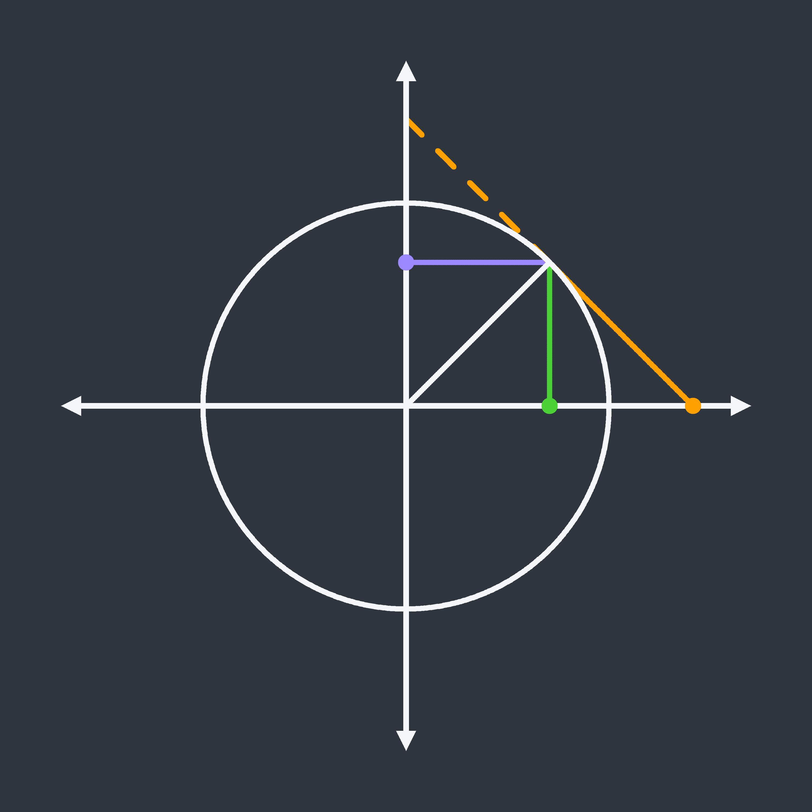
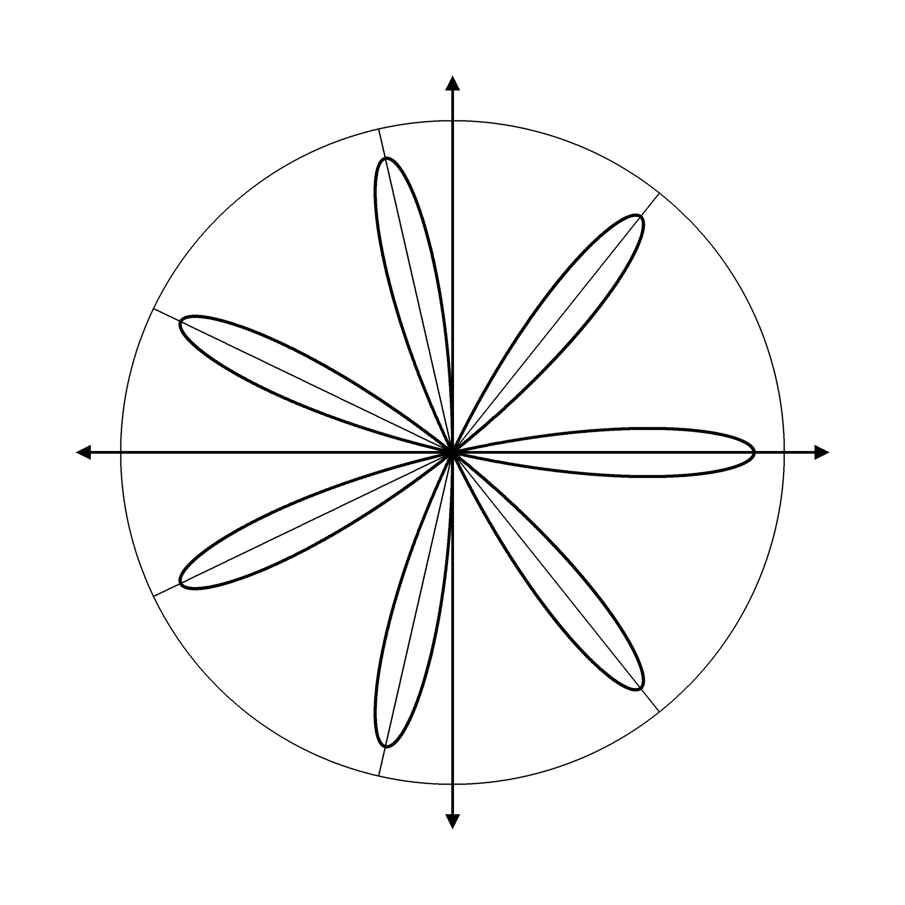
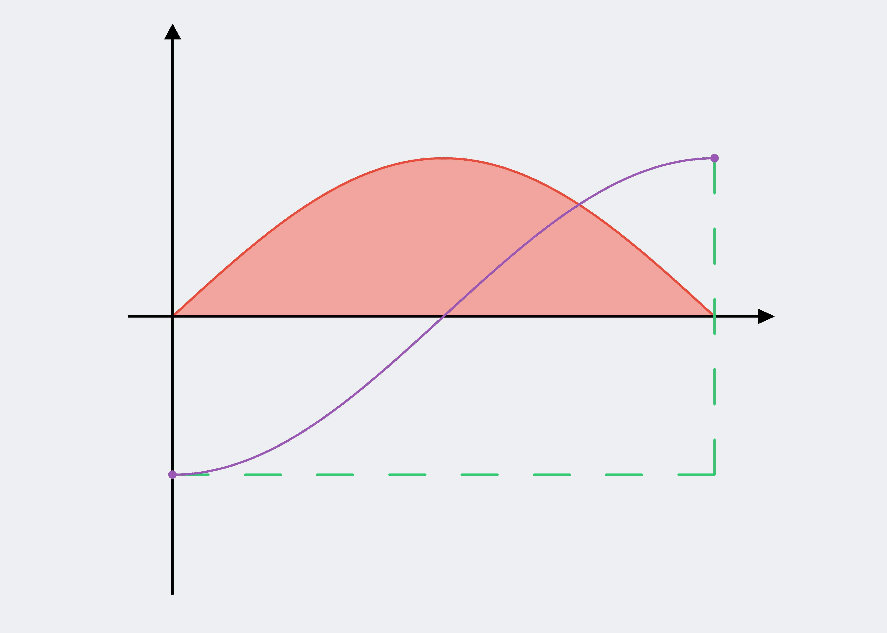

# Mathil

## Contents 

* [Introduction](#introduction)  
* [Examples](#examples)  
    * [Venn Diagram](#venn-diagram) 
    * [Geometric Representations of Trigonometric Functions](#trig-geometry)
    * [Rose](#rose)
    * [Fundamental Theorem of Calculus Illustration](#fundamental-theorem-of-calculus)
    * [Adding Complex Numbers](#adding-complex-numbers)
* [Setup](#setup)
* [Getting Started](#getting-started)
* [Documentation](#documentation)
* [Q and A](#q-and-a)

<a name="introduction"></a>
## Introduction

Mathil is a library I have created in F# for drawing neat and consistent images that represent mathematical concepts in a programmatic way, with relatively low level control and not too much code.

<a name="examples"></a>
## Examples:

The following examples show how a few different kinds of images can be created using Mathil. The original bitmap images, along with functions which you can call to generate these images can also be found in the `examples` folder above. I have also written up a full explanation of how the code for the first image works in the ***Getting Started*** section.

<a name="venn-diagram"></a>
### Venn Diagram


```
let resolution = (3000, 2000)
let boundingBox = (createPoint (0.0, 0.0), createPoint (150.0, 100.0))
let backgroundColor = CSSColour.almond
    
let blankScreen = createScreen resolution boundingBox backgroundColor
    
let leftCircle =
    createCircle 25.0 (createPoint (60.0, 50.0))

let rightCircle =
    createCircle 25.0 (createPoint (90.0, 50.0))
    
blankScreen
|> renderManyFunctions [leftCircle; rightCircle] CSSColour.black 10 900 RenderingType.Round
|> colourFill (createPoint (75.0, 50.0)) (Colour.fromHex "#9b59b6")
|> colourFill (createPoint (60.0, 50.0)) CSSColour.babyBlue
|> colourFill (createPoint (90.0, 50.0)) CSSColour.alizarinCrimson
|> saveScreenToBitmap "<path to folder here>" "VennDiagram"
```

<a name = "trig-geometry"></a>
### Geometric Representations of Trigonometric Functions



```
open System

let angle = pi / 4.0
let cos = Math.Cos(angle)
let sin = Math.Sin(angle)
let sec = 1.0 / cos
let cosec = 1.0 / sin
    
let resolution = (3000, 3000)
let boundingBox = (createPoint (-2.0, -2.0), createPoint (2.0, 2.0))
let backgroundColor = Colour.fromHex "#2f3640"
    
let blankScreen = createScreen resolution boundingBox backgroundColor
    
let unitCircle =
    createCircle 1.0 (createPoint (0.0, 0.0)) // 800 samples
let radius =
    createLineSegment (createPoint (0.0, 0.0)) (createPoint (cos, sin)) // 100 samples
    
let sineLine =
    createLineSegment (createPoint (cos, 0.0)) (createPoint (cos, sin)) // 100 samples
let cosineLine =
    createLineSegment (createPoint (0.0, sin)) (createPoint (cos, sin)) // 100 samples
let tangentLine =
    createLineSegment (createPoint (cos, sin)) (createPoint (sec, 0)) // 100 samples
let tangentDashedLine =
    createDashedLine (createPoint (cos, sin)) (createPoint (0.0, cosec)) 5
    
let cosineEndpoint = createPoint (0.0, sin)
let sineEndpoint = createPoint (cos, 0.0)
let tangentEndpoint = createPoint (sec, 0.0)
    
let sineColour = Colour.fromHex "#4cd137"
let cosineColour = Colour.fromHex "#9c88ff"
let tangentColour = CSSColour.orangePeel
let offWhite = Colour.fromHex "#f5f6fa"
    
blankScreen
|> renderFunction sineLine sineColour 10 100 RenderingType.Round
|> renderFunction cosineLine cosineColour 10 100 RenderingType.Round
|> renderFunction tangentLine tangentColour 10 100 RenderingType.Round
|> renderDashedLine tangentDashedLine tangentColour 10 40 RenderingType.Round
|> renderFunction unitCircle offWhite 10 800 RenderingType.Round
|> renderFunction radius offWhite 10 100 RenderingType.Round
|> renderCartesianPlane offWhite 10 300 0.1 0.1 0.4
|> renderPoint sineEndpoint sineColour 30
|> renderPoint cosineEndpoint cosineColour 30
|> renderPoint tangentEndpoint tangentColour 30
|> saveScreenToBitmap "<path to folder here>" "TrigGeometricRepresentation"
```

<a name ="rose"></a>
### Rose



```
open System

let coefficient = 7

let resolution = (3000, 3000)
let boundingBox = (createPoint (-1.5, -1.5), createPoint (1.5, 1.5))
let backgroundColour = CSSColour.white

let blankScreen = createScreen resolution boundingBox backgroundColour

let rose =
    createFunction (p_rose (float coefficient)) (0.0, 2.0 * pi)

let circleRadius = 1.1

let radialLines =
    [
        for i = 0 to (coefficient * 2) do
            if (coefficient % 2 = 1 && i % 2 = 0) || coefficient % 2 = 0 then
                yield createLineSegment (createPoint (0.0, 0.0)) (createPoint (circleRadius * Math.Cos(float i * pi / (float (coefficient))), circleRadius * Math.Sin(float i * pi / (float (coefficient)))))
    ]

let circle =
    createCircle circleRadius (createPoint (0.0, 0.0))

blankScreen
|> renderFunction rose CSSColour.black 5 8000 RenderingType.Round
|> renderCartesianPlane CSSColour.black 4 2000 0.05 0.05 0.3
|> renderManyFunctions radialLines CSSColour.black 2 1000 RenderingType.Round
|> renderFunction circle CSSColour.black 2 5000 RenderingType.Round
|> saveScreenToBitmap "<path to folder here>" "Rose"
```

<a name = "fundamental-theorem-of-calculus"></a>
### Fundamental Theorem of Calculus Illustration



```
let resolution = (4200, 3000)
let boundingBox = (createPoint (-1.0, -2.0), createPoint (pi + 1.0, 2.0))
let backgroundColour = Colour.fromHex "#ecf0f1"

let blankScreen = createScreen resolution boundingBox backgroundColour

let sineFunction =
    createFunction p_sin (0, pi)

let negativeCosineFunction =
    createFunction (fun t -> negateYPoint (p_cos t)) (0, pi)

let negativeCosineEndpoints =
    [
        createPoint (pi, 1.0)
        createPoint (0.0, -1.0)
    ]

let horizontalAxis = createVector (createPoint (pi + 0.25, 0.0)) (createPoint (-0.25, 0.0)) 0.1 0.1
let verticalAxis = createVector (createPoint (0.0, 1.75)) (createPoint (0.0, -1.75)) 0.1 0.1

let greenAngle =
    [
        createDashedLine (createPoint (0.0, -1.0)) (createPoint (pi, -1.0)) 8
        createDashedLine (createPoint (pi, -1.0)) (createPoint (pi, 1.0)) 5
    ]
    |> List.concat

blankScreen
|> renderFunction sineFunction (Colour.fromHex "#e74c3c") 5 2000 RenderingType.Round
|> renderManyVectors [horizontalAxis; verticalAxis] CSSColour.black 5 1000 RenderingType.Square
|> renderManyFunctions greenAngle (Colour.fromHex "#2ecc71") 5 300 RenderingType.Round
|> renderManyPoints negativeCosineEndpoints (Colour.fromHex "#9b59b6") 20
|> colourFill (createPoint (pi / 2.0, 0.5)) (Colour.fromHex "#f2a59d")
|> renderFunction negativeCosineFunction (Colour.fromHex "#9b59b6") 5 2000 RenderingType.Round
|> saveScreenToBitmap "<path to folder here>" "FundamentalTheoremOfCalculus"
```

<a name="adding-complex-numbers"></a>
### Adding Complex Numbers


```
let resolution = (3000, 3000)
let boundingBox = (createPoint (-6.0, -6.0), createPoint (6.0, 6.0))
let backgroundColour = CSSColour.darkLavender

let blankScreen = createScreen resolution boundingBox backgroundColour

let minorAxisLines =
    [
        for i in [-4..4] do
            yield
                createLineSegment (createPoint (float i, -4.0)) (createPoint (float i, 4.0))

            yield
                createLineSegment (createPoint (-4.0, float i)) (createPoint (4.0, float i))
    ]

let linesToComplexPoints =
    [
        createLineSegment (createPoint (-3.0, 1.0)) (createPoint (0.0, 0.0))
        createLineSegment (createPoint (1.0, 2.0)) (createPoint (0.0, 0.0))
    ]

let complexPoints =
    createPoints [-3.0, 1.0; 1.0, 2.0; -2.0, 3.0]

let parallelogram =
    createPolygon (createPoints [0.0, 0.0; 1.0, 2.0; -2.0, 3.0; -3.0, 1.0])

blankScreen
|> renderSolidPolygon parallelogram (Colour.fromHex "#e7b864")
|> renderManyFunctions minorAxisLines CSSColour.white 2 600 RenderingType.Square
|> renderCartesianPlane CSSColour.white 10 150 0.2 0.2 1.0
|> renderManyFunctions linesToComplexPoints CSSColour.orangeWebColor 10 400 RenderingType.Round
|> renderManyPoints complexPoints CSSColour.orangeWebColor 40
|> saveScreenToBitmap "<path to folder here>" "AddingComplexNumbers"
```

<a name="setup"></a>
## Setup

The simplest way to install and use Mathil is to download the `.nupkg` file from the `package` folder from NuGet package manager by running:

```
Install-Package C:\PathToThePackageDirectory\Mathil.nupkg
```

If you are using Visual Studio you can also right click on the project, select **Manage NuGet Packages...** and specify the package source to be the folder where the `.nupkg` file is, before clicking on the package in the **Browse** tap and selecting **Install**.

The `package` folder includes all previous versions of the library. This is so that if you develop something for the library in a previous version that causes an incompatibility on the most recent release, the corresponding version that was originally used is available. If you are using Mathil for the first time, please download the highests version.

If you wish to modify the source code, I have included a Visual Studio solution which includes the class library project for Mathil and a debugging console app project, which should make working with the source code easier. This is how I have been working on this project. This will also mean you can run the library without installing the `.nupkg` file.

Once you have Mathil installed or the source code available, simply add the following declarations at the top of the file and get coding!

```
open Mathil.Colours
open Mathil.MathematicalObjects
open Mathil.Rendering
open Mathil.CompoundShapes
open Mathil.Bitmap
```

<a name="getting-started"></a>
## Getting Started

To get started, here is a more thorough walkthrough of how the first example above was created.

When creating our image, we first need to decide on the resolution, bounding box and background colour, so lets set those variables, explaining them as we go.

```
let resolution = (3000, 2000)
let boundingBox = (createPoint (0.0, 0.0), createPoint (150.0, 100.0))
let backgroundColor = CSSColour.almond
```

The `resolution` will the resolution of our final image. When creating something from scratch, don't worry if you get this wrong, it's easy to change later with minimal cost.

The `bounding box` specifies the coordinates system that will be used when drawing curves and shapes. This is independent of the resolution so that you can easily set it to match what you're drawing, and so that the either can be changed after the fact without effecting the other. For example, if we wanted to draw a sine curve, I may set the bounding box to have ***x*** values just either side of -2 pi, and ***y*** values just either side of -1 and 1. Mathil will then scale your bounding box to fit your resolution. To make sure your image doesn't get stretched too much, it is recommended you call the `aspectRatios` function, will which give you the aspect ratio of the resolution and bounds in turn, so that you can see how different they are and see how much your image is stretched.

The background colour just represents the default colour we will use for our screen before we draw anything on it. In this case the `CSSColours` class has been used, which contains the colours from the CSS standard. Feel free to also use `Colour.fromRGB` or `Colour.fromHex` to customize the colours yourself.

Now we have those set, let's create our blank screen.

```
let blankScreen = createScreen resolution boundingBox backgroundColor
```

Notice that this variable is of type `Screen`. We have our screen now because we want to use its features to figure out how each other element will be rendered, but we won't actually add anything to it until the end.

Now let's create some circles for our venn diagram. When drawing a mathematical function in Mathil, we need to create something of type `Function` (or something implicitly convertible to it). The type declaration for a `Function` is as follows:

```
type Function =
    { Rule : float -> Point; Domain : Domain }
```

The rule is just a parametric function from a float to a point. When creating a rule for yourself, you just need to create a function of that form, using `createPoint` to correctly create an instance of the `Point` type.

Luckily for us though, I have implemented a `createCircle` function. This will figure out all the implementation details of a circle for us.

Given our bounding box (150.0, 100.0), I am going to choose the radius of our circle to be 50 and the location to be (60.0, 50.0), which will make our circle half the height of the image, and position it slightly offset from the centre along our horizontal axis.

```
let leftCircle =
    createCircle 25.0 (createPoint (60.0, 50.0))
```

Let's do the same for the right circle now, that'll be pretty similar, but just a different value for the ***x*** coordinate of the centre.

```
let rightCircle =
    createCircle 25.0 (createPoint (90.0, 50.0))
```

Now we can render our two circles on the image. Since each circle is of type `Circle`, which is an alias for `Function`, we can render each to the screen by using the `renderFunction` function. This function takes in the colour we wish to use, the thickness of our curve, the number of samples (this is because it's rendered as a series of points) and the rendering type (which determines if each sample point is rendered as a circle or square).

If the ability to resize the image after the fact without disturbing the relative line thickness is important, I recommend you use the `calculateLineThickness` function and specify the thickness as a proportion of the overall image size. This means that lines will get thicker if the resolution is changed, without having to manually change them.

```
blankScreen
|> renderFunction leftCircle CSSColour.black 10 900 RenderingType.Round
|> renderFunction rightCircle CSSColour.black 10 900 RenderingType.Round
```

Since we are rendering two curves with the same rendering settings, we can simplify our code with a single call to `renderManyFunctions` as follows:

```
blankScreen
|> renderManyFunctions [leftCircle; rightCircle] CSSColour.black 10 900 RenderingType.Round
```

Next we need to fill each section of our diagram with the colour we wish. To do this we can use the `colourFill` function. This will take a starting point somewhere in the desired region, and the colour we wish to change it to, and it will fill that region accordingly. So let's add three calls to that to our pipeline, each specifying a point somewhere within each of the 3 regions.

```
blankScreen
|> renderManyFunctions [leftCircle; rightCircle] CSSColour.black 10 900 RenderingType.Round
|> colourFill (createPoint (75.0, 50.0)) (Colour.fromHex "#9b59b6")
|> colourFill (createPoint (60.0, 50.0)) CSSColour.babyBlue
|> colourFill (createPoint (90.0, 50.0)) CSSColour.alizarinCrimson
```

The last thing we need to do is save our image to a file. This can be done using the `saveScreenToBitmap` function which requires the folder you wish to save the image to and the file name. This is easiest to add to our pipeline.

```
blankScreen
|> renderManyFunctions [leftCircle; rightCircle] CSSColour.black 10 900 RenderingType.Round
|> colourFill (createPoint (75.0, 50.0)) (Colour.fromHex "#9b59b6")
|> colourFill (createPoint (60.0, 50.0)) CSSColour.babyBlue
|> colourFill (createPoint (90.0, 50.0)) CSSColour.alizarinCrimson
|> saveScreenToBitmap @"C:\Users\aaron\Downloads" "VennDiagram"
```

Obviously I have specified the file path as required for my computer, so change this according to where you want the image to be.

If you're not happy with anything, then just go back over your code, change it and run again. If you work with high resolution images, the files produced by this library are quite large as they are uncompressed bitmaps. You can see more about this decision in the Q and A section at the bottom of this page, but in short, if you wish to use another format I recommend converting to a `.png` which will allow significantly smaller file size without a huge loss in quality (or in some cases no loss in quality), especially given a lot of the images that you may produce with this tool have big solid colours.

This is one example of something that can be done using Mathil, for full documentation on all the features of Mathil, see below.

<a name="documentation"></a>
## Documentation

I am working on thorough documentation of all the functions in this library which will be available ***here*** when complete.

<a name="q-and-a"></a>
## Q and A

#### Where does the name come from?

**Math**ematical **Il**lustrations. It was the best I could come up with...

#### Why would I use this instead of a vector drawing tool or a standard graphing calculator?

I created this to be used in place of a vector drawing tool because it more easily provides consistent results when many similar illustrations must be created, and because it allows fundamentally mathematical concepts to be illustrated from the mathematical objects themselves (parametric curves, colour mixing, etc..). In terms of graphing calculators, they are generally designed as a tool to use while solving a problem, or as an educational tool. This tool is more catered towards people looking for static illustrations to include in texts.

#### How well supported will this tool be?

As I need new features for my own purposes I will be adding them in, but I do not use this tool for my job or studying so that will be my free time only, and I make no promises about how long I will maintain it. That said, if you have ideas please create an issue and I will occasionally look to see what I can add to make it useful to others, or if you see the framework for something useful to you here but require more features, feel free to fork the repository and work on it yourself. In the meantime, I have set up a project where I will add stuff that I plan to add and stuff I am working on, which you can find [here](https://github.com/users/aaron-jack-manning/projects/13).

#### What file formats does this library produce?

All exports are 24bit, uncompressed bitmaps. This is because they are easy to read and write from keeping development and computation time down and well supported enough that they are no trouble to open, view and convert to another format easily. I have no plans to add the capability to export as other image formats.

#### Why has (insert feature) been implemented the way that it has?

I am no expert at computer graphics, and this project has been my way of learning the basics of 2D computer graphics. As such, you may find some of my implementations to be non-standard and strange, because I had serious trouble finding decent resources to understand the standard implementations of what I have done. I just did things the way that seemed most logical to me.
