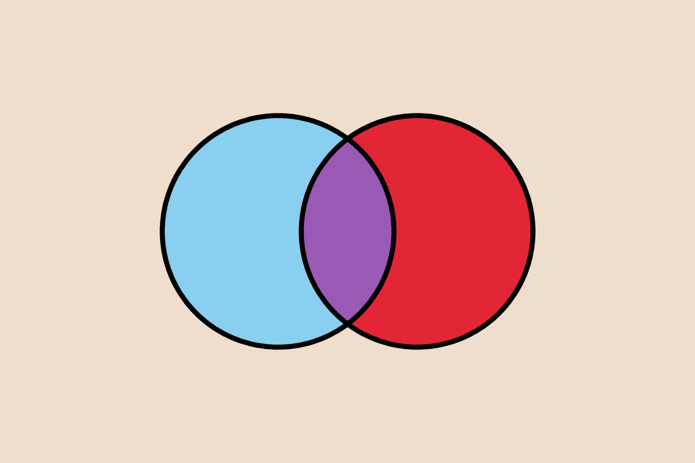
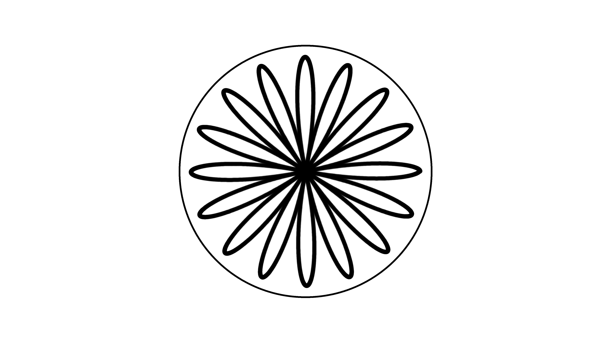
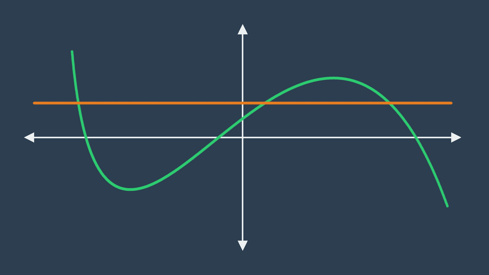
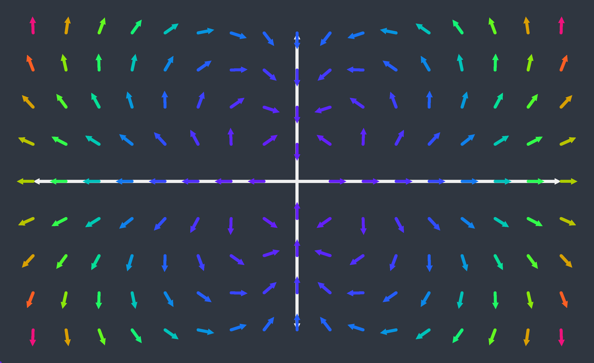

# Mathil

## Introduction

Mathil is a Rust library for drawing and animating illustrations that are intrinsically mathematical, in a programmatic way with a relatively minimal amount of code, and still a fair amount of low level control. This library is primarily designed around use by educators.

## Examples

The following images and videos were all created using Mathil, with source code that can be found in the `examples` folder.

### Venn Diagram



[Source Code](examples/venn-diagram/main.rs)

### Geometric Representations of Trigonometric Functions


[Source Code](examples/geometric-representations-of-trig-functions/main.rs)

[High Quality Video](https://www.youtube.com/watch?v=SYb_QUx1BE0)

### Rose



[Source Code](examples/rose/main.rs)

[High Quality Video](https://www.youtube.com/watch?v=SlcujkXnz8M)

### Curve Intersection



[Source Code](examples/curve-intersection/main.rs)

[High Quality Video](https://www.youtube.com/watch?v=x_0A-ukn5gE)

## Setup

The easiest way to get up and running using Mathil is to clone this repository, open `library/mathil/src/main.rs` and begin writing your code in there. The source code for the examples above are provided in the form of the main file to use in this project.

Then, with cargo installed, run your code with the following command:

```
cargo run --release
```

While debug and release profiles are configured, due to the nature of Mathil being a library for drawing graphics to write to a file, rather than to integrate into a larger code base, it's recommended that you run in release mode under most circumstances due to the huge performance improvements that come with greater optimization. As such, overflow checks are still enabled in release mode. Check `Cargo.toml` for specific details.

## Dependencies

Originally this library only supported writing to 24-bit uncompressed bitmaps, which is a file type I chose due to the simplicity of the standard and therefore the ease of implementation. Due to the fact that the library is now oriented towards ease of animation, outputs of a more common filetype with smaller filesizes was required, hence the ability to now write to PNG images. This is through the `png` crate which is documented [here](https://crates.io/crates/png). This crate and it's dependencies are only dependencies of this project. Eventually I plan on writing my own PNG authoring code.

## Getting Started

This section is designed to be an introduction into some of the basic features of Mathil, by explaining how the venn diagram example above was created. For complete documentation on all features, including those for animation, see the next section with full documentation.

Before following this set of instructions, set up your project according to the getting started section above. As such, you should have a main file which looks like this:

```
use mathil::{
    colours::*,
    maths_objects::*,
    rendering::*,
    utilities::*,
    animation::*,
    errors::Error,
};

fn main() {}
```

The code I am about to write, unless otherwise specified, will appear in the `main` function.

Let's start be declaring variables for the horizontal and vertical resolution. We will define the vertical resolution in terms of the horizontal resolution such that it can easily be adjusted later without effecting the aspect ratio.

```
let horizontal_resolution = 3000;

let vertical_resolution =
        horizontal_resolution / 3 * 2;
```

Now we create the image on which to render our venn diagram. To do this we create what in Mathil is called a `Screen` using the `Screen::new` function.

```
Screen::new(
    horizontal_resolution, vertical_resolution,
    Point::new(0.0, 0.0), Point::new(150.0, 100.0),
    css_colours::ALMOND
)
```

This function first takes as input the horizontal and vertical resolution which we defined earlier. The next two variables are points, which define the boundaries of our image in a coordinate system which is independent of the resolution. In this case, we have set the bottom left point as `(0, 0)` and the top right point as `(150, 100)`. This is the coordinate system that we will use when rendering everything, and Mathil will stretch the image correctly for us. This means if we change the resolution later, everything we render will still be in the same relative position.

Finally, we need to specify an initial colour of the screen. The type `Colour` has member functions `from_hex` and `from_rgb` which will create an colour, but in this case we am just going to use a from the CSS standard, all of which are defined in the `css_colours` module.

We then need to render the circles of our venn diagram. Since we are going to need to fill the colours of them, and Mathil uses solid colours to fill, we are going to render two circles first, then do the colour fill, and then render two circles over the top later. This lets us use an anti-aliasing effect on our top circles, whilst still having a distinct colour to fill at the start.

Here are the two functions that will give us our desired left and right circle.

```
fn left_circle() -> Function {
    Function::new_circle(
        25.0,
        Point::new(60.0, 50.0),
        (0.0, TAU)
    )
}

fn right_circle() -> Function {
    Function::new_circle(
        25.0,
        Point::new(90.0, 50.0),
        (0.0, TAU)
    )
}
```

Within these functions we are creating an instance of a type in Mathil called a `Function`. A `Function` is internally just a parametric function from an `f32` to a `Point` which we saw earlier, and a domain on which to sample that function. A `Function` can be created by directly giving the parametric rule and the `Function::new` function but here we are using the `Function::new_circle` abstraction which allows is to create a circle from the radius and the centre. We also specify the domain, which by default goes from `0` to `TAU` which makes it easier to define a partial circle if we wish. Also note that to make use of `TAU` we need to include the following declaration at the top of the file:

```
use std::f32::consts::TAU;
```

Now we need to render each of these circles to the screen. In Mathil, the trait `Renderable` defines mathematical objects which can be rendered to the screen.

```
pub trait Renderable {
    type RenderSettings;

    /// Renders the renderable item on the provided screen.
    fn render(self, settings : &Self::RenderSettings, screen : &mut Screen);

    /// Renders many of the renderable item on the provided screen.
    fn render_many(selfs : Vec<Box<Self>>, settings : &Self::RenderSettings, screen : &mut Screen);
}
```

The screen then has a function called `render` and `render_many` which call the members on the types satisfying this trait, taking ownership of and then returning the screen. As such, when rendering to a screen it is typical to write code something like this:

```
Screen::new(
    ...
)
.render(
    ...
)
.render_many(
    ...
)
...
```

A `Function` is one such type with implements `Renderable`. When we render any given type, there is also an associated type of which we must provide an instance for the settings that define how it is rendered. In this case we are after an instance of `FunctionRenderSettings`.

Going back to our screen from before, let's add the code to render two circles:

```
Screen::new(
    horizontal_resolution, vertical_resolution,
    Point::new(0.0, 0.0), Point::new(150.0, 100.0),
    css_colours::ALMOND
)
.render_many(
    vec![Box::new(left_circle()), Box::new(right_circle())],
    FunctionRenderSettings::new(
        css_colours::BLACK,
        Thickness::Relative(0.3),
        900,
        RenderingType::RoundAliased
    )
)
```

The function render settings that are provided define the colour we wish to render the circle, the thickness of the line, specified either relatively (depending on the bounding box we specified when creating the screen) or absolutely (as a number of pixels), the number of samples of the functions and the way it will be rendered. This final parameter of `RenderingType` determines how each sample of the function is rendered. Here, we do not want an anti-aliasing effect because of the colour fill we will do after. Let's now move on to that colour fill, continuing the code above:

```
.fill(
    Point::new(75.0, 50.0),
    Colour::from_hex("#9b59b6")
)
.fill(
    Point::new(60.0, 50.0),
    css_colours::BABY_BLUE
)
.fill(
    Point::new(90.0, 50.0),
    css_colours::ALIZARIN_CRIMSON
)
```

Colour fills are done by giving a starting point and a colour. The `fill` function then fills the solid colour containing the starting point with the new colour. The first fill also gives an example of creating a colour from a hex code string.

Now we just need to render the circles again over the top, with an anti-aliasing effect.

```
.render_many(
    vec![Box::new(left_circle()), Box::new(right_circle())],
    FunctionRenderSettings::new(
        css_colours::BLACK,
        Thickness::Relative(0.6),
        900,
        RenderingType::RoundAntiAliased(2.0)
    )
)
```

Notice that the rendering settings are the same except that we have made it a bit thicker compared to the original line and the `RenderingType` is not the `RoundAntiAliased` case. This case of the enum takes in a float which determines how strong the effect is. High values here give something closer to `RenderingType::RoundAliased` while smaller values give a softer look. `2.0` is generally a good place to start for relatively thin lines.

Finally we need to take this screen and write it to a file to see the output. We can do this with either of the `write_to_png` or `write_to_bmp` member functions, both of which take as input a folder and filename (without the extension).

This leaves our final code as:

```
use mathil::{
    colours::*,
    maths_objects::*,
    rendering::*,
    utilities::*,
    animation::*,
    errors::Error,
};

use std::f32::consts::TAU;

fn left_circle() -> Function {
    Function::new_circle(
        25.0,
        Point::new(60.0, 50.0),
        (0.0, TAU)
    )
}

fn right_circle() -> Function {
    Function::new_circle(
        25.0,
        Point::new(90.0, 50.0),
        (0.0, TAU)
    )
}

fn main() {
    let horizontal_resolution = 3000;

    let vertical_resolution =
            horizontal_resolution / 3 * 2;

    Screen::new(
        horizontal_resolution, vertical_resolution,
        Point::new(0.0, 0.0), Point::new(150.0, 100.0),
        css_colours::ALMOND
    )
    .render_many(
        // Render the two circles thinner than desired in preparation for the colour fill.
        vec![Box::new(left_circle()), Box::new(right_circle())],
        FunctionRenderSettings::new(
            css_colours::BLACK,
            Thickness::Relative(0.3),
            900,
            RenderingType::RoundAliased
        )
    )
    .fill(
        Point::new(75.0, 50.0),
        Colour::from_hex("#9b59b6")
    )
    .fill(
        Point::new(60.0, 50.0),
        css_colours::BABY_BLUE
    )
    .fill(
        Point::new(90.0, 50.0),
        css_colours::ALIZARIN_CRIMSON
    )
    .render_many(
        // Render the top circles after the fill.
        vec![Box::new(left_circle()), Box::new(right_circle())],
        FunctionRenderSettings::new(
            css_colours::BLACK,
            Thickness::Relative(0.6),
            900,
            RenderingType::RoundAntiAliased(2.0)
        )
    )
    .write_to_png("/home/Pictures", "venn-diagram").unwrap();
}
```

## Full Documentation

Full documentation is available [here](documentation/main.pdf).

## Add on Crates

I am currently experimenting with creating additional crates with abstractions on top of Mathil to make illustrations for specific common use cases easier to create. Currently one such crate exists for vector fields but I plan on adding in additional crates for drawing graphs of one variable functions, networks, etc. Below is one example from each existing add on crate.

### Example: Vector Field



[Source Code](examples/vector-field/main.rs)

## Q and A

#### Where does the name come from?

**Math**ematical **Il**lustrations. It was the best I could come up with...

#### Is this library stable in terms of updates?

No. As it stands, since I am the primary user of this tool and it is still in early stages, I am regularly making breaking changes to it. This is mostly for the flexibility of being able to redesign core aspects of the library where appropriate. Once Mathil is truly stable in the sense that I no longer feel the need to change crucial aspects of it, I will start versioning it and minimising breaking changes. At that point I will also guarantee greater correctness of documentation, since, as it stands, although I try and update the documentation at each release inevitable some things will slip through.

#### How well supported will this tool be?

This project is now at the stage where it is capable enough for me to regularly use it in my own projects, and as such I am implementing new features as I see a need for them in my own workflow. I still have plans to implement a better colour mixing tool with which you can track my progress [here](https://github.com/aaron-jack-manning/colour-mixing-experiments), and a font rendering tool. If you have ideas please create an issue and I will occasionally look to see what I can add to make it useful to others, or if you see the framework for something useful to you here but require more features, feel free to fork the repository and turn it into something catered to your needs.

#### I have found a bug in the code, or error in documentation, what should I do?

If you find a mistake in anything I have written here, or a bug in my code, I would greatly appreciate it if you could create an issue on this repository so I can fix it, even if you do fix it before then in your local copy.

#### Why has (insert feature) been implemented the way that it has?

I am no expert at computer graphics, and this project has been my way of learning the basics of 2D computer graphics. As such, you may find some of my implementations to be non-standard and strange, because I had serious trouble finding decent resources to understand the standard implementations of what I have done. I just did things the way that seemed most logical to me.

#### What license is this issued under?

Mathil is released with the GPLv2 license. Please see `LICENSE` at the top level of this repository.

tldr: if you write and release code that uses Mathil, it must also be licensed under GPLv2, but feel free to use Mathil with your own code to create images and videos for personal or commercial purposes and keep the code you have written private.

#### What is the project in archive?

Mathil originally started as just a static illustration library in F#. I migrated the project to Rust while I was first learning it since itt would give better performance when attempting to do animations, and traits provide a much neater implementation for rendering objects. The original F# version is provided there along with the README file as it was when it was last changed, which includes documentation for it, but it is recommended that you use the version provided here unless you plan on maintaining it yourself, since I will not be updating that version if bugs are found, and it is now many features behind the current version.
