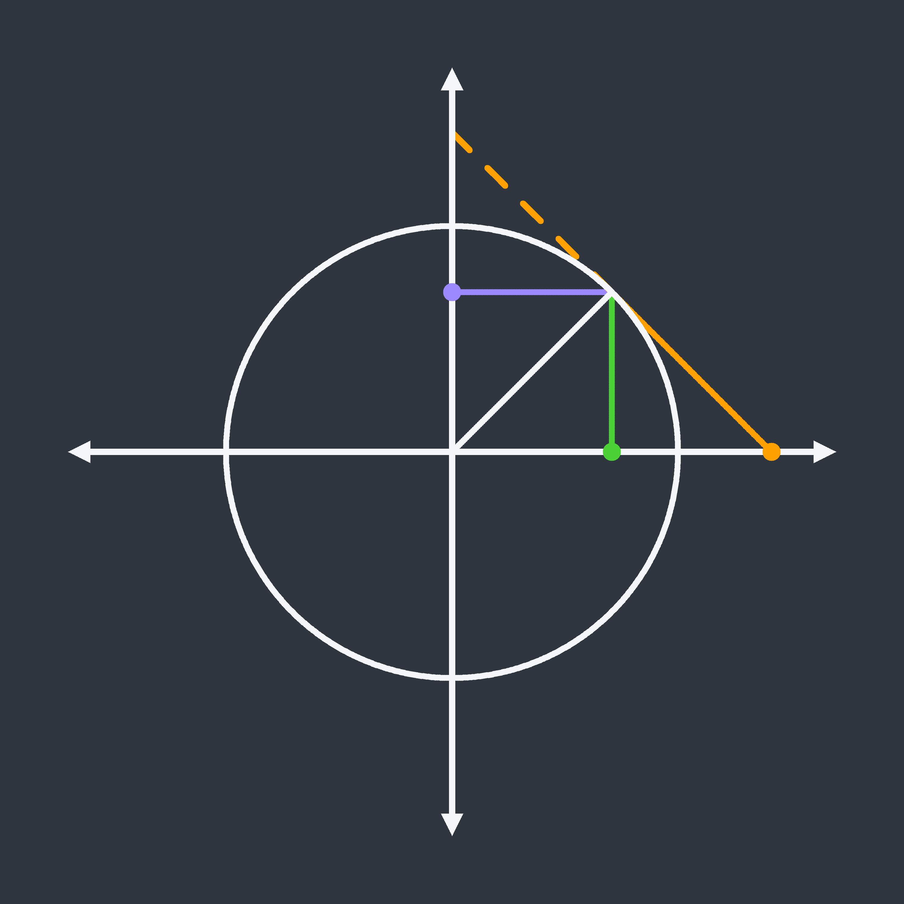
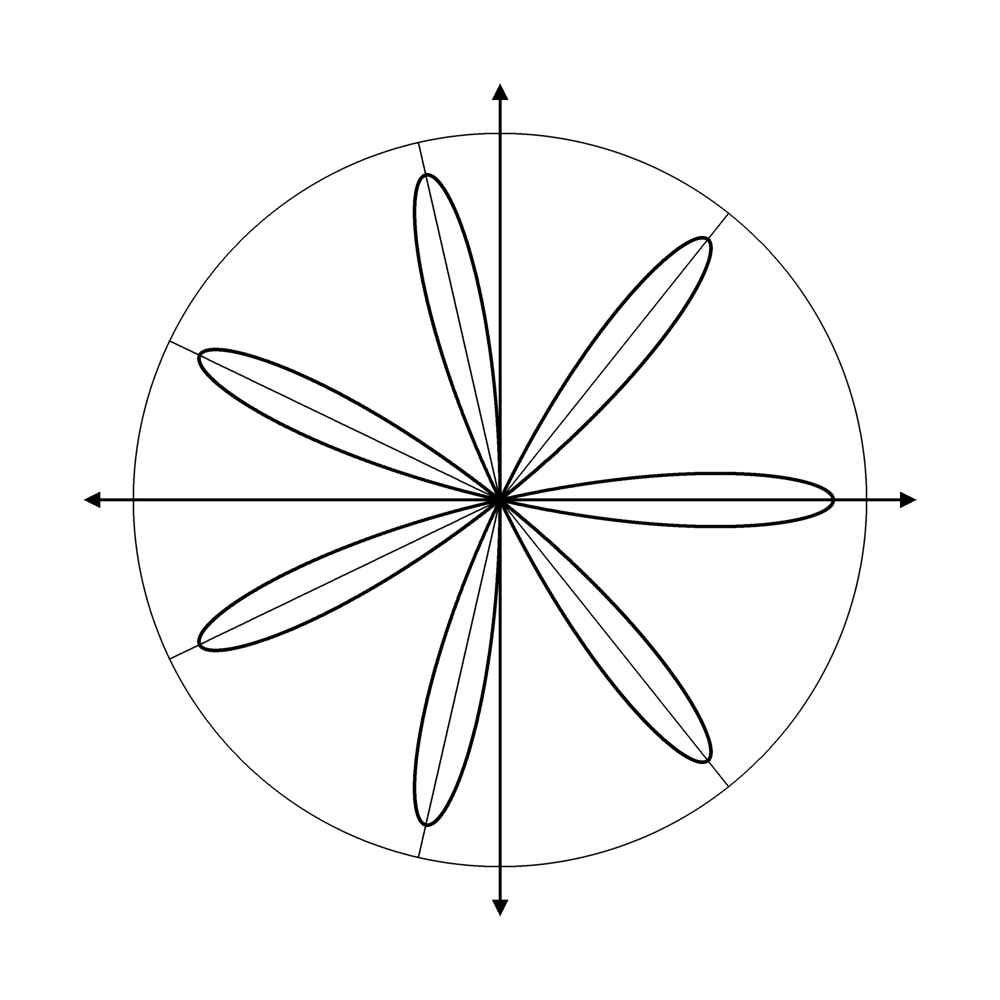
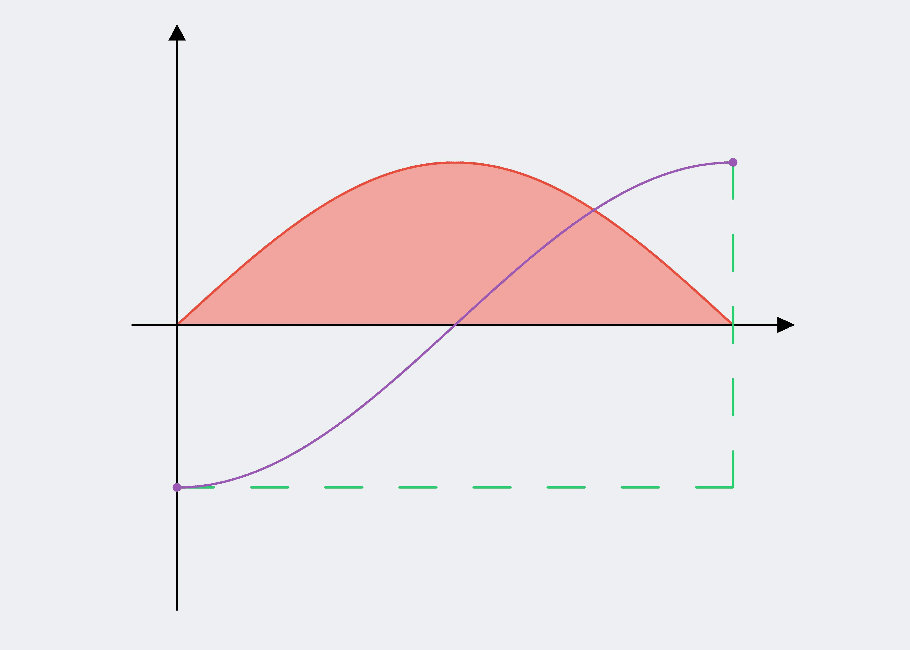
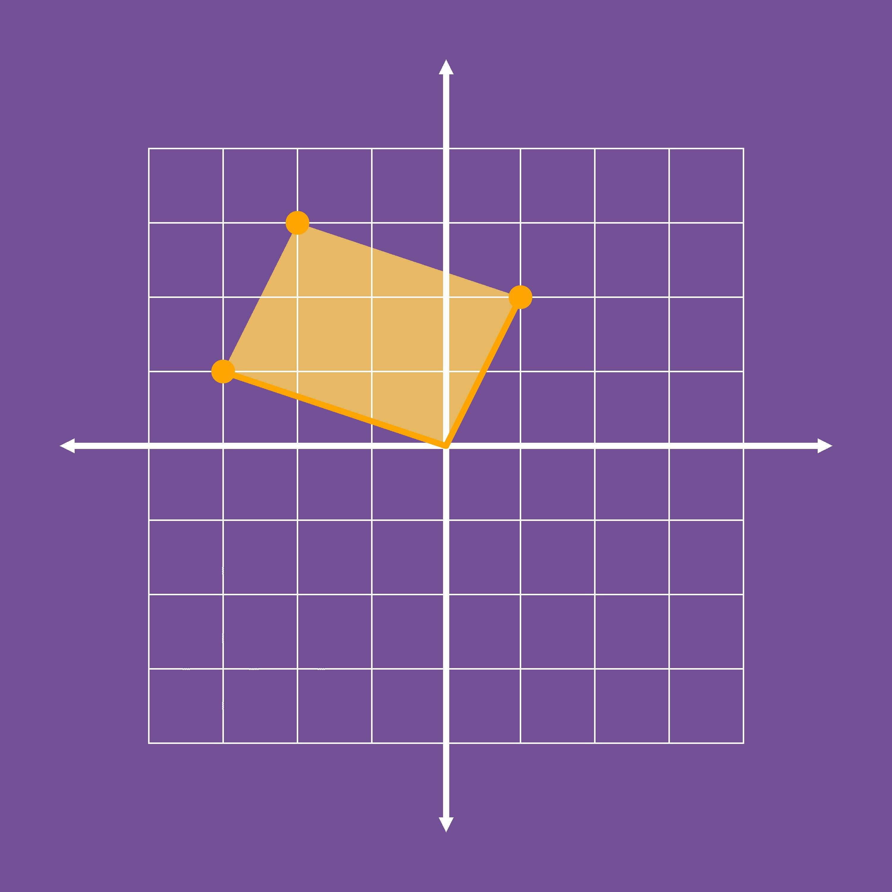
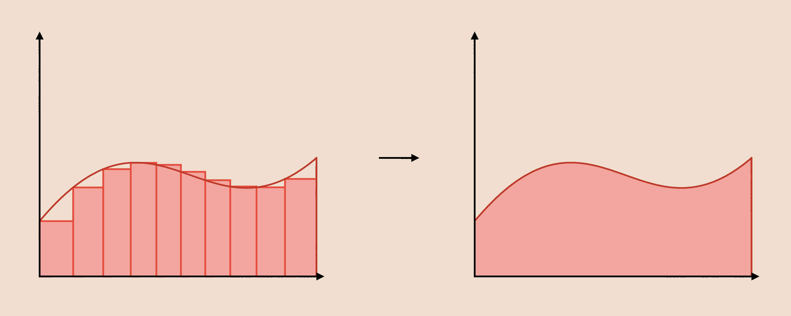

# Mathil

**Note:** The following information is regarding the F# version of Mathil, which was the first implementation. I am no longer actively developing this version, and it is missing many key features now moved to the new implementation in Rust. The Contents of this README are as they were when development on this version stopped. This is given here for archival purposes, in case anyone reading this wishes to download the source code and improve upon it for their own usage. I do not recommend using this version as is though, now that a more performant and feature rich version exists.

## Contents 

* [Introduction](#introduction)  
* [Examples](#examples)  
    * [Venn Diagram](#venn-diagram) 
    * [Geometric Representations of Trigonometric Functions](#trig-geometry)
    * [Rose](#rose)
    * [Fundamental Theorem of Calculus Illustration](#fundamental-theorem-of-calculus)
    * [Adding Complex Numbers](#adding-complex-numbers)
    * [Riemann Sum](#riemann-sum)
* [Setup](#setup)
* [Getting Started](#getting-started)
* [Documentation](#documentation)
    * [Exposed Functions](#exposed-functions)
    * [Colours](#colours)
    * [Screens](#screens)
    * [Mathematical Objects](#mathematical-objects)
    * [Rendering](#rendering)
        * [Rendering Simple Types](#rendering-simple-types)
        * [Colour Fills](#colour-fills)
        * [Polygons](#polygons)
* [Q and A](#q-and-a)
    * [Where does the name come from?](#where-does-the-name-come-from)
    * [Why would I use this instead of a vector drawing tool or a standard graphing calculator?](#why-would-I-use-this-instead-of-a-vector-drawing-tool-or-a-standard-graphing-calculator)
    * [How well supported will this tool be?](#how-well-supported-will-this-tool-be)
    * [What file formats does this library produce?](#what-file-formats-does-this-library-produce)
    * [I have found a bug in the code, or error in documentation, what should I do?](#i-have-found-a-bug-in-the-code-or-error-in-documentation-what-should-I-do)
    * [Why has (insert feature) been implemented the way that it has?](#why-has-insert-feature-been-implemented-the-way-that-it-has)
    * [What license is this issued under?](#what-license-is-this-issued-under) 

<a name="introduction"></a>
## Introduction

Mathil is a library I have created in F# for drawing neat and consistent images that represent mathematical concepts in a programmatic way, with relatively low level control and not too much code.

<a name="examples"></a>
## Examples:

The following examples show how a few different kinds of images can be created using Mathil. The uncompressed bitmap images, along with functions which you can call to generate these images can also be found in the `examples` folder above. I have also written up a full explanation of how the code for the first image works in the ***Getting Started*** section.

<a name="venn-diagram"></a>
### Venn Diagram


```
let resolution = (3000, 2000)
let boundingBox = (createPoint (0.0, 0.0), createPoint (150.0, 100.0))
let backgroundColour = CSSColour.almond
    
let blankScreen = createScreen resolution boundingBox backgroundColour
    
let leftCircle =
    createCircle 25.0 (createPoint (60.0, 50.0))

let rightCircle =
    createCircle 25.0 (createPoint (90.0, 50.0))
    
blankScreen
|> renderManyFunctions [leftCircle; rightCircle] CSSColour.black 10 900 RenderingType.Round
|> colourFill (createPoint (75.0, 50.0)) (Colour.fromHex "#9b59b6")
|> colourFill (createPoint (60.0, 50.0)) CSSColour.babyBlue
|> colourFill (createPoint (90.0, 50.0)) CSSColour.alizarinCrimson
|> saveScreenToBitmap "<path to folder here>" "VennDiagram"
```

<a name="trig-geometry"></a>
### Geometric Representations of Trigonometric Functions



```
open System

let angle = Constants.pi / 4.0
let cos = Math.Cos(angle)
let sin = Math.Sin(angle)
let sec = 1.0 / cos
let cosec = 1.0 / sin
    
let resolution = (3000, 3000)
let boundingBox = (createPoint (-2.0, -2.0), createPoint (2.0, 2.0))
let backgroundColor = Colour.fromHex "#2f3640"
    
let blankScreen = createScreen resolution boundingBox backgroundColor
    
let unitCircle =
    createCircle 1.0 (createPoint (0.0, 0.0))
let radius =
    createLineSegment (createPoint (0.0, 0.0)) (createPoint (cos, sin))
    
let sineLine =
    createLineSegment (createPoint (cos, 0.0)) (createPoint (cos, sin))
let cosineLine =
    createLineSegment (createPoint (0.0, sin)) (createPoint (cos, sin))
let tangentLine =
    createLineSegment (createPoint (cos, sin)) (createPoint (sec, 0))
let tangentDashedLine =
    createDashedLine (createPoint (cos, sin)) (createPoint (0.0, cosec)) 5
    
let cosineEndpoint = createPoint (0.0, sin)
let sineEndpoint = createPoint (cos, 0.0)
let tangentEndpoint = createPoint (sec, 0.0)
    
let sineColour = Colour.fromHex "#4cd137"
let cosineColour = Colour.fromHex "#9c88ff"
let tangentColour = CSSColour.orangePeel
let offWhite = Colour.fromHex "#f5f6fa"
    
blankScreen
|> renderFunction sineLine sineColour 10 100 RenderingType.Round
|> renderFunction cosineLine cosineColour 10 100 RenderingType.Round
|> renderFunction tangentLine tangentColour 10 100 RenderingType.Round
|> renderDashedLine tangentDashedLine tangentColour 10 40 RenderingType.Round
|> renderFunction unitCircle offWhite 10 800 RenderingType.Round
|> renderFunction radius offWhite 10 100 RenderingType.Round
|> renderCartesianPlane offWhite 10 300 0.1 0.1 0.4
|> renderPoint sineEndpoint sineColour 30
|> renderPoint cosineEndpoint cosineColour 30
|> renderPoint tangentEndpoint tangentColour 30
|> saveScreenToBitmap "<path to folder here>" "TrigGeometricRepresentation"
```

<a name="rose"></a>
### Rose



```
open System

let coefficient = 7

let resolution = (3000, 3000)
let boundingBox = (createPoint (-1.5, -1.5), createPoint (1.5, 1.5))
let backgroundColour = CSSColour.white

let blankScreen = createScreen resolution boundingBox backgroundColour

let rose =
    createFunction (Parametric.rose (float coefficient)) (0.0, 2.0 * Constants.pi)

let circleRadius = 1.1

let radialLines =
    [
        for i = 0 to (coefficient * 2) do
            if (coefficient % 2 = 1 && i % 2 = 0) || coefficient % 2 = 0 then
                yield createLineSegment (createPoint (0.0, 0.0)) (createPoint (circleRadius * Math.Cos(float i * Constants.pi / (float (coefficient))), circleRadius * Math.Sin(float i * Constants.pi / (float (coefficient)))))
    ]

let circle =
    createCircle circleRadius (createPoint (0.0, 0.0))

blankScreen
|> renderFunction rose CSSColour.black 5 8000 RenderingType.Round
|> renderCartesianPlane CSSColour.black 4 2000 0.05 0.05 0.3
|> renderManyFunctions radialLines CSSColour.black 2 1000 RenderingType.Round
|> renderFunction circle CSSColour.black 2 5000 RenderingType.Round
|> saveScreenToBitmap "<path to folder here>" "Rose"
```

<a name="fundamental-theorem-of-calculus"></a>
### Fundamental Theorem of Calculus Illustration



```
let resolution = (4200, 3000)
let boundingBox = (createPoint (-1.0, -2.0), createPoint (Constants.pi + 1.0, 2.0))
let backgroundColour = Colour.fromHex "#ecf0f1"

let blankScreen = createScreen resolution boundingBox backgroundColour

let sineFunction =
    createFunction Parametric.sin (0, Constants.pi)

let negativeCosineFunction =
    createFunction (fun t -> Point.negateY (Parametric.cos t)) (0, Constants.pi)

let negativeCosineEndpoints =
    [
        createPoint (Constants.pi, 1.0)
        createPoint (0.0, -1.0)
    ]

let horizontalAxis = createVector (createPoint (Constants.pi + 0.25, 0.0)) (createPoint (-0.25, 0.0)) 0.1 0.1
let verticalAxis = createVector (createPoint (0.0, 1.75)) (createPoint (0.0, -1.75)) 0.1 0.1

let greenAngle =
    [
        createDashedLine (createPoint (0.0, -1.0)) (createPoint (Constants.pi, -1.0)) 8
        createDashedLine (createPoint (Constants.pi, -1.0)) (createPoint (Constants.pi, 1.0)) 5
    ]
    |> List.concat

blankScreen
|> renderFunction sineFunction (Colour.fromHex "#e74c3c") 5 2000 RenderingType.Round
|> renderManyVectors [horizontalAxis; verticalAxis] CSSColour.black 5 1000 RenderingType.Square
|> renderManyFunctions greenAngle (Colour.fromHex "#2ecc71") 5 300 RenderingType.Round
|> renderManyPoints negativeCosineEndpoints (Colour.fromHex "#9b59b6") 20
|> colourFill (createPoint (Constants.pi / 2.0, 0.5)) (Colour.fromHex "#f2a59d")
|> renderFunction negativeCosineFunction (Colour.fromHex "#9b59b6") 5 2000 RenderingType.Round
|> saveScreenToBitmap "<path to folder here>" "FundamentalTheoremOfCalculus"
```

<a name="adding-complex-numbers"></a>
### Adding Complex Numbers



```
let resolution = (3000, 3000)
let boundingBox = (createPoint (-6.0, -6.0), createPoint (6.0, 6.0))
let backgroundColour = CSSColour.darkLavender

let blankScreen = createScreen resolution boundingBox backgroundColour

let minorAxisLines =
    [
        for i in [-4..4] do
            yield
                createLineSegment (createPoint (float i, -4.0)) (createPoint (float i, 4.0))

            yield
                createLineSegment (createPoint (-4.0, float i)) (createPoint (4.0, float i))
    ]

let linesToComplexPoints =
    [
        createLineSegment (createPoint (-3.0, 1.0)) (createPoint (0.0, 0.0))
        createLineSegment (createPoint (1.0, 2.0)) (createPoint (0.0, 0.0))
    ]

let complexPoints =
    createPoints [-3.0, 1.0; 1.0, 2.0; -2.0, 3.0]

let parallelogram =
    createPolygon (createPoints [0.0, 0.0; 1.0, 2.0; -2.0, 3.0; -3.0, 1.0])

blankScreen
|> renderSolidPolygon parallelogram (Colour.fromHex "#e7b864")
|> renderManyFunctions minorAxisLines CSSColour.white 2 600 RenderingType.Square
|> renderCartesianPlane CSSColour.white 10 150 0.2 0.2 1.0
|> renderManyFunctions linesToComplexPoints CSSColour.orangeWebColor 10 400 RenderingType.Round
|> renderManyPoints complexPoints CSSColour.orangeWebColor 40
|> saveScreenToBitmap "<path to folder here>" "AddingComplexNumbers"
```

<a name="riemann-sum"></a>
### Riemann Sum



```
let resolution = (5000, 2000)
let boundingBox = (createPoint (0.0, 0.0), createPoint (500.0, 200.0))
let backgroundColour = CSSColour.almond
    
let blankScreen = createScreen resolution boundingBox backgroundColour

let shift = 275.0

let axis =
    [
        createVector (createPoint (200, 25)) (createPoint (25, 25)) 5 5
        createVector (createPoint (200.0 + shift, 25)) (createPoint (25.0 + shift, 25)) 5 5
        createVector (createPoint (25, 175)) (createPoint (25, 25)) 5 5
        createVector (createPoint (25.0 + shift, 175)) (createPoint (25.0 + shift, 25)) 5 5
    ]

let transitionArrow =
    createVector (createPoint (260, 100)) (createPoint (240, 100)) 5 5

let leftFunction =
    createBezierCurve (createPoints [25, 60; 100, 150; 130, 40; 200, 100])
let rightFunction =
    createBezierCurve (createPoints [25.0 + shift, 60; 100.0 + shift, 150; 130.0 + shift, 40; 200.0 + shift, 100])

let functionBounds =
    [
        createLineSegment (createPoint (200.0, 100)) (createPoint (200.0, 25))
        createLineSegment (createPoint (200.0 + shift, 100)) (createPoint (200.0 + shift, 25))
    ]
    
let numberOfColumns = 10.0

let columns =
    [
        for i = 0 to int numberOfColumns - 1 do
            let columnWidth = 175.0 / numberOfColumns
            let leftSide = 25.0 + columnWidth * (float i)
            let rightSide = leftSide + columnWidth

            let functionPointLeft = leftFunction.Rule (columnWidth * (float i) / 175.0)
            let functionPointRight = leftFunction.Rule (columnWidth * (float i + 1.0) / 175.0)

            yield createPolygon (functionPointLeft :: (createPoints [functionPointLeft.X, 25.0; functionPointRight.X, 25.0; functionPointRight.X, functionPointLeft.Y]))
    ]

let red1 = Colour.fromHex "#c0392b"
let red2 = Colour.fromHex "#e74c3c"
let red3 = Colour.fromHex "#f2a59d"

blankScreen
|> renderManySolidPolygons columns red3
|> renderManyPolygonsSides columns red2 5 400 RenderingType.Square
|> renderManyFunctions [leftFunction; rightFunction] red1 5 1000 RenderingType.Round
|> renderManyFunctions functionBounds red1 5 1000 RenderingType.Square
|> renderManyVectors (transitionArrow :: axis) CSSColour.black 5 500 RenderingType.Square
|> colourFill (createPoint (400.0, 50.0)) red3
|> saveScreenToBitmap "<path to folder here>" "RiemannSum"
```

<a name="setup"></a>
## Setup

The simplest way to install and use Mathil is to download the `.nupkg` file from the `package` folder from NuGet package manager by running:

```
Install-Package C:\PathToThePackageDirectory\Mathil.nupkg
```

If you are using Visual Studio you can also right click on the project, select **Manage NuGet Packages...** and specify the package source to be the folder where the `.nupkg` file is, before clicking on the package in the **Browse** tap and selecting **Install**.

The `package` folder includes all previous versions of the library. This is so that if you develop something for the library in a previous version that causes an incompatibility on the most recent release, the corresponding version that was originally used is available. If you are using Mathil for the first time, please download the highests version.

If you wish to modify the source code, I have included a Visual Studio solution which includes the class library project for Mathil and a debugging console app project, which should make working with the source code easier. This is how I have been working on this project. This will also mean you can run the library without installing the `.nupkg` file.

Once you have Mathil installed or the source code available, simply add the following declarations at the top of the file and get coding!

```
open Mathil.Colours
open Mathil.MathematicalObjects
open Mathil.Rendering
open Mathil.CompoundShapes
open Mathil.Bitmap
```

<a name="getting-started"></a>
## Getting Started

To get started, here is a more thorough walkthrough of how the first example above was created.

When creating our image, we first need to decide on the resolution, bounding box and background colour, so lets set those variables, explaining them as we go.

```
let resolution = (3000, 2000)
let boundingBox = (createPoint (0.0, 0.0), createPoint (150.0, 100.0))
let backgroundColour = CSSColour.almond
```

The `resolution` will the resolution of our final image. When creating something from scratch, don't worry if you get this wrong, it's easy to change later with minimal cost.

The `bounding box` specifies the coordinates system that will be used when drawing curves and shapes. This is independent of the resolution so that you can easily set it to match what you're drawing, and so that the either can be changed after the fact without effecting the other. For example, if we wanted to draw a sine curve, I may set the bounding box to have ***x*** values just either side of -2 pi, and ***y*** values just either side of -1 and 1. Mathil will then scale your bounding box to fit your resolution. To make sure your image doesn't get stretched too much, it is recommended you call the `aspectRatios` function, will which give you the aspect ratio of the resolution and bounds in turn, so that you can see how different they are and see how much your image is stretched.

The background colour just represents the default colour we will use for our screen before we draw anything on it. In this case the `CSSColours` class has been used, which contains the colours from the CSS standard. Feel free to also use `Colour.fromRGB` or `Colour.fromHex` to customize the colours yourself.

Now we have those set, let's create our blank screen.

```
let blankScreen = createScreen resolution boundingBox backgroundColor
```

Notice that this variable is of type `Screen`. We have our screen now because we want to use its features to figure out how each other element will be rendered, but we won't actually add anything to it until the end.

Now let's create some circles for our venn diagram. When drawing a mathematical function in Mathil, we need to create something of type `Function` (or something implicitly convertible to it). The type declaration for a `Function` is as follows:

```
type Function =
    { Rule : float -> Point; Domain : Domain }
```

The rule is just a parametric function from a float to a point. When creating a rule for yourself, you just need to create a function of that form, using `createPoint` to correctly create an instance of the `Point` type.

Luckily for us though, I have implemented a `createCircle` function. This will figure out all the implementation details of a circle for us.

Given our bounding box (150.0, 100.0), I am going to choose the radius of our circle to be 50 and the location to be (60.0, 50.0), which will make our circle half the height of the image, and position it slightly offset from the centre along our horizontal axis.

```
let leftCircle =
    createCircle 25.0 (createPoint (60.0, 50.0))
```

Let's do the same for the right circle now, that'll be pretty similar, but just a different value for the ***x*** coordinate of the centre.

```
let rightCircle =
    createCircle 25.0 (createPoint (90.0, 50.0))
```

Now we can render our two circles on the image. Since each circle is of type `Circle`, which is an alias for `Function`, we can render each to the screen by using the `renderFunction` function. This function takes in the colour we wish to use, the thickness of our curve, the number of samples (this is because it's rendered as a series of points) and the rendering type (which determines if each sample point is rendered as a circle or square).

If the ability to resize the image after the fact without disturbing the relative line thickness is important, I recommend you use the `calculateLineThickness` function and specify the thickness as a proportion of the overall image size. This means that lines will get thicker if the resolution is changed, without having to manually change them.

```
blankScreen
|> renderFunction leftCircle CSSColour.black 10 900 RenderingType.Round
|> renderFunction rightCircle CSSColour.black 10 900 RenderingType.Round
```

Since we are rendering two curves with the same rendering settings, we can simplify our code with a single call to `renderManyFunctions` as follows:

```
blankScreen
|> renderManyFunctions [leftCircle; rightCircle] CSSColour.black 10 900 RenderingType.Round
```

Next we need to fill each section of our diagram with the colour we wish. To do this we can use the `colourFill` function. This will take a starting point somewhere in the desired region, and the colour we wish to change it to, and it will fill that region accordingly. So let's add three calls to that to our pipeline, each specifying a point somewhere within each of the 3 regions.

```
blankScreen
|> renderManyFunctions [leftCircle; rightCircle] CSSColour.black 10 900 RenderingType.Round
|> colourFill (createPoint (75.0, 50.0)) (Colour.fromHex "#9b59b6")
|> colourFill (createPoint (60.0, 50.0)) CSSColour.babyBlue
|> colourFill (createPoint (90.0, 50.0)) CSSColour.alizarinCrimson
```

The last thing we need to do is save our image to a file. This can be done using the `saveScreenToBitmap` function which requires the folder you wish to save the image to and the file name. This is easiest to add to our pipeline.

```
blankScreen
|> renderManyFunctions [leftCircle; rightCircle] CSSColour.black 10 900 RenderingType.Round
|> colourFill (createPoint (75.0, 50.0)) (Colour.fromHex "#9b59b6")
|> colourFill (createPoint (60.0, 50.0)) CSSColour.babyBlue
|> colourFill (createPoint (90.0, 50.0)) CSSColour.alizarinCrimson
|> saveScreenToBitmap @"C:\Users\aaron\Downloads" "VennDiagram"
```

Obviously, I have specified the file path as required for my computer, so change this according to where you want the image to be.

If you're not happy with anything, then just go back over your code, change it and run again. If you work with high resolution images, the files produced by this library are quite large as they are uncompressed bitmaps. You can see more about this decision in the Q and A section at the bottom of this page, but in short, if you wish to use another format I recommend converting to a `.png` which will allow significantly smaller file size without a huge loss in quality (or in some cases no loss in quality), especially given a lot of the images that you may produce with this tool have big solid colours.

This is one example of something that can be done using Mathil, for more thorough documentation on all the features of Mathil, see below.

<a name="documentation"></a>
## Documentation

<a name="exposed-functions"></a>
### Exposed Functions

The following shows the hierarchy of namespaces, modules, types and functions for everything exposed in Mathil.

```
namespace Mathil

    module Colours

        /// Represents a colour as RGB values.
        type Colour

        /// Functions for operating on colours.
        module Colour

            /// Create colour from RGB values.
            fromRGB (r : byte, g : byte, b : byte) : Colour

            /// Create colour from #RRGGBB hex format.
            fromHex (hexCode : string) : Colour

            /// Linearly interpolates the red, green and blue values of the colour separately.
            lerp (colour1 : Colour) (colour2 : Colour) (parameter : float) : Colour

            /// Mixes two colours together (not very successfully - it is recommended that colour mixing is done manually).
            mix (colour1 : Colour) (colour2 : Colour) : Colour

        /// Consists of all colours in the CSS standard.
        module CSSColour

            airForceBlueRaf

            airForceBlueUsaf

            airSuperiorityBlue

            ...

    module MathematicalObjects

        /// Mathematical constants.
        module Constants

            /// Ratio of circumference to diameter of circle.
            pi

            /// Ratio of circumference to radius of circle.
            tau

            /// Euler's constant.
            e

        /// Types to represent mathematical objects.
        module Types

            /// Represents a point in the 2D coordinate system used in drawing shapes.
            type Point

                /// Multiplies the coordinates of a point pairwise.
                static member (*) (scalar : float, point : Point)

                /// Adds the coordinates of a point pairwise.
                static member (+) (point1 : Point, point2 : Point)

                /// Subtracts the coordinates of a point pairwise.
                static member (-) (point1 : Point, point2 : Point)

            /// Represents a mathematical function as a parametric rule and domain.
            type Function

            /// Represents a Bezier curve as a function.
            type BezierCurve

            /// Represents a line segment as a function.
            type LineSegment

            /// Represents a dashed line as a list of line segments.
            type DashedLine

            /// Represents a polygon as a series of points.
            type Polygon

            /// Represents a vector as a line segment and polygon.
            type Vector

            /// Represents a circle as a function.
            type Circle

        /// Functions for operating on points.
        module Point

            /// Negates both coordinates of a point.
            negate (point : Point) : Point

            /// Negates the x coordinate of a point.
            negateX (point : Point) : Point

            /// Negates the y coordinate of a point.
            negateY (point : Point) : Point

            /// Calculates the gradient of the segment from the origin to the specified point.
            gradient (point : Point) : float

            /// Calculates the gradient of the normal to the segment from the origin to the specified point.
            normalGradient (point : Point) : float

            /// Calculates the distance from the point to the origin.
            distance (point : Point) : float

            /// Rotates the point 90 degrees about the origin clockwise.
            rotateClockwise (point : Point) : Point

            /// Rotates the point 90 degrees about the origin counterclockwise.
            rotateCounterClockwise (point : Point) : Point

            /// Linearly interpolates the two specified points.
            lerp (start : Point) (finish : Point) : (float -> Point)

        /// Standard parametric functions (float -> Point).
        module Parametric

            /// Parametric sine function.
            inline sin (x : float) : Point

            /// Parametric cosine function.
            inline cos (x : float) : Point

            /// Parametric tangent function.
            inline tan (x : float) : Point

            /// Parametric secant function.
            inline sec (x : float) : Point

            /// Parametric cosecant function.
            inline csc (x : float) : Point

            /// Parametric cotangent function.
            inline cot (x : float) : Point

            /// Parametric natural logarithm function.
            inline ln (x : float) : Point

            /// Parametric exponential function.
            inline exp (x : float) : Point

            /// Parametric ellipse function.
            inline ellipse (rx : float) (ry : float) (x1 : float) (y1  : float) (t  : float) : Point

            /// Parametric rose function.
            inline rose (a : float) (t : float) : Point

        /// Creates a Point from a float tuple.
        createPoint (x : float, y : float) : Point

        /// Creates a list of points from a list of float tuples.
        createPoints (coordinates : (float * float) list) : Point list

        /// Creates a Function from a rule and domain.
        createFunction (rule : float -> Point) (domain : float * float) : Function

        /// Creates a Bezier curve from a list of points.
        createBezierCurve (points : Point list) : BezierCurve

        /// Creates a line from its endpoints.
        createLineSegment (start : Point) (finish : Point) : LineSegment

        /// Creates a series of short lines that create a longer dashed line.
        createDashedLine (start : Point) (finish : Point) (dashes : int) : DashedLine

        /// Creates a polygon from a list of points.
        createPolygon (vertices : Point list) : Polygon

        /// Creates a vector from its head, tail and the dimensions of the arrow head.
        createVector (head : Point) (tail : Point) (arrowWidth : float) (arrowHeight : float) : Vector

        /// Creates a circle from its centre and radius.
        createCircle (radius : float) (centre : Point) : Circle


    module Rendering

        /// Represents an image.
        type Screen

        /// Represents the coordinates of a given pixel.
        type PixelCoordinates

        /// Represents the way a dot is rendered.
        type RenderingType

        /// Calculates the aspect ratio in the resolution and in the bounds, to check how significantly the mathematical coordinates system is squeezed before rendering the image.
        aspectRatios (screen : Screen) : float * float

        /// Calculates the line thickness as a proportion of the average of the horizontal and vertical resolutions. Allows line thickness to be scaled appropriates upon changing an image's resolution.
        calculateLineThickness (resolution : int * int) (proportion : float) : int

        /// Creates a blank screen based on the resolution, bounds and colour.
        createScreen (horizontalResolution : int, verticalResolution : int) (bounds : Point * Point) (defaultColour : Colour) : Screen

        /// Renders a point.
        renderPoint (point : Point) (colour : Colour) (radius : int) (screen : Screen) : Screen

        /// Renders many points if the same rendering settings are desired for all of them.
        renderManyPoints (points : Point list) (colour : Colour) (radius : int) (screen : Screen) : Screen

        /// Renders any type implicitly convertable to Function, including line segments, circles and Bezier curves.
        renderFunction (func : Function) (colour : Colour) (thickness : int) (samples : int) (renderingType : RenderingType) (screen : Screen) : Screen

        /// Renders many functions if the same rendering settings are desired for all of them.
        renderManyFunctions (funcs : Function list) (colour : Colour) (thickness : int) (samples : int) (renderingType : RenderingType) (screen : Screen) : Screen

        /// Fills a region of a screen which has a solid colour with another solid colour.
        colourFill (startingPoint : Point) (desiredColour  : Colour) (screen : Screen) : Screen

        /// Completes a colour fill on many distinct starting points if the same colour is desired for all of them.
        colourFillMany (startingPoints : Point list) (desiredColour : Colour) (screen : Screen) : Screen

        /// Renders a solid polygon of the specified colour, independent of the background. Use this instead of colourFill when other elements may already rendered where the polygon should go.
        renderSolidPolygon (polygon : Polygon) (desiredColour : Colour) (screen : Screen) : Screen

        /// Renders many solid poligons if the same rendering settings are desired for all of them.
        renderManySolidPolygons (polygons : Polygon list) (desiredColour : Colour) (screen : Screen) : Screen

        /// Renders a vector.
        renderVector (vector : Vector) (colour : Colour) (thickness : int) (samples : int) (renderingType : RenderingType) (screen : Screen) : Screen

        /// Renders many vectors if the same rendering settings are desired for all of them.
        renderManyVectors (vectors : Vector list) (colour : Colour) (thickness : int) (samples : int) (renderingType : RenderingType) (screen : Screen) : Screen

        /// Renders the sides of a polygon.
        renderPolygonSides (polygon : Polygon) (colour : Colour) (thickness : int) (samplesPerSide : int) (renderingType : RenderingType) (screen : Screen) : Screen

        /// Renders the sides of many polygons if the same rendering settings are desired for all of them.
        renderManyPolygonsSides (polygons : Polygon list) (colour : Colour) (thickness : int) (samplesPerSide : int) (renderingType : RenderingType) (screen : Screen) : Screen

        /// Renders a dashed line.
        renderDashedLine (dashedLine : DashedLine) (colour : Colour) (thickness : int) (samplesPerDash : int) (renderingType : RenderingType) (screen : Screen) : Screen

    module CompoundShapes

        /// Adds a cartesian plane to the specified image.
        renderCartesianPlane (colour : Colour) (thickness : int) (samples : int) (arrowHeight : float) (arrowWidth : float) (borderWidth : float) (screen : Screen) : Screen

    module Bitmap

        /// Writes the provided screen to the specified filepath as a bitmap (.bmp) file.
        saveScreenToBitmap (filepath : string) (filename : string) (screen : Screen) : unit
```


<a name="colours"></a>
### Colours

The type in Mathil that represents a colour is called a `Colour` and has the following declaration.

```
/// Represents a colour as RGB values.
type Colour =
    {
        Red : byte;
        Green : byte;
        Blue : byte
    }
```

To create a colour, use one of the following functions:

- `Colour.fromRGB (r : byte, g : byte, b : byte) : Colour` which creates a colour directly from the red, green and blue values.
- `Colour.fromHex (hexCode : string) : Colour` which creates a colour using the hexadecimal #RRGGBB format.

When working with colours, you can also linearly interpolate between two colours using:

```
Colour.lerp (colour1 : Colour) (colour2 : Colour) (parameter : float) : Colour
```

and specifying a parameter between 0 and 1.

Additionally, there is a colour mixing function:

```
Colour.mix (colour1 : Colour) (colour2 : Colour) : Colour
```

Note that the current implementation of this function fails to give an effective mix in many cases. Mixing colours in a computer is really hard, and I am working hard on a better solution but it may be a while before I can release such an update.

For the sake of having a set of familiar colours built in, I have also implemented all colours in the CSS standard. These exist as static members of the `CSSColour` type.

<a name="screens"></a>
### Screens

The record type in Mathil that represents the image is called a `Screen` and has the following declaration.

```
/// Represents an image.
type Screen =
    {
        Pixels : Colour [,]
        HorizontalResolution : int
        VerticalResolution : int
        BottomLeftBound : Point
        TopRightBound : Point
    }
```

To create a screen, we call the `createScreen` function. When creating a screen, we need to specify what resolution we would like for the screen, the initial colour of all the pixels, and the bottom left and top right bounds of our screen. Here is an example usage of this function:

```
let resolution = (1000, 1000)
let boundingBox = (createPoint (0.0, 0.0), createPoint (10.0, 10.0))
let backgroundColour = CSSColour.black

let blankScreen = createScreen resolution boundingBox backgroundColour
```

*Everywhere in Mathil that an ordered pair is used to represent a point or coordinates, the horizontal coordinate is specified first.*

While `resolution` and `backgroundColour` should be fairly self explanatory, it is worth taking extra care to explain the importance of the `boundingBox`. The purpose of this parameter is to allow a coordinates system to be specified to work with in terms of the mathematical objects being rendered, rather than the resolution. For example, when drawing the graph of sine, it makes sense to set the boundaries of the screen in terms of pi. If we then set the bounding box accordingly, then we can draw our sine function and specify points in that system, and Mathil will automatically convert the coordinate system of our bounding box to the resolution of the screen when rendering.

As a consequence of the way Mathil coerces the coordinates in terms of the bounding box to the screen resolution, it is possible to stretch and distort the image if there is a discrepancy in the aspect ratios. To quickly check the aspect ratios call the `aspectRatios` function and display the result as follows.

```
printfn "%A" (aspectRatios blankScreen)
```

This will display the aspect ratio of the screen resolution and bounding box in turn, to gague how significantly the image is stretched.

The recommended way to use Mathil is to avoid rendering anything to the screen until the end. That said, we generally create the screen first since some functions require the data on the screen beyond the array of colours, such as the bounding box. Hence we create the screen, use it's parameters when creating other objects, and then render those objects to the screen. Information on the different mathematical objects to ultimately render follows in the next section.

<a name="mathematical-objects"></a>
### Mathematical Objects

All mathematical objects are declared in `MathematicalObjects.Types`. This module includes the following types:

Point: To be rendered directly, or to represent characteristics of other types.
```
type Point =
    {
        X : float
        Y : float
    }
```

Function: A parametric function and domain, used when rendering arbitrary curves.
```
type Function =
    {
        Rule : float -> Point
        Domain : float * float
    }

```

BezierCurve: An alias for function which represents a Bezier curve.
```
type BezierCurve = Function
```

LineSegment: An alias for function which represents a line segment curve.
```
type LineSegment = Function
```

DashedLine: A list of line segments which represent a dashed line.
```
type DashedLine = LineSegment list
```

Polygon: A polygon represented by the vertices in cyclic order and a line segment for each edge.
```
type Polygon =
    {
        Vertices : Point list
        Edges : LineSegment list
    }
```

Vector: A vector represented by a line segment for the body and a triangle for the head.
```
type Vector =
    {
        Line : LineSegment
        ArrowHead : Polygon
    }
```

Circle: An alias for function which represents a circle.
```
type Circle = Function
```

Each of these types should be created by calling it's corresponding 'create' function such as `createFunction`, `createPolygon`, etc. These functions take in only the required data to represent the mathematical object, but *do not* accept any data regarding the way it will be rendered (such as colour or line thickness).

<a name="rendering"></a>
### Rendering

<a name="rendering-simple-types"></a>
#### Rendering Simple Types

In general, the best way to render the desired mathematical objects is to pipeline a series of rendering functions on the screen. Many types have their own specific rendering functions, while all types that are aliases for function can be rendered using `renderFunction`. When rendering an object, the corresponding rendering function also takes in parameters regarding the way the object should be rendered. Here is one example of rendering a circle named `circle` on the initial screen `blankScreen`.

```
blankScreen
|> renderFunction circle CSSColour.black 10 300 RenderingType.Round
```

Here the thickness has been specified as 10, and means the line thickness of our circle will be 10 pixels. Due to the fact that the thickness is specified as a number of pixels, this means that if the resolution of the screen is changed, even though the shape of elements will be stretched to match, the lines will appear to be thicker or thinner relative to the whole image. To counter this issue, please use the `calculateLineThickness` function which will calculate the line thickness as a proportion of the overall image size, and therefore maintain relative thickness across resolution changes.

The number of samples, which is 300 here, represents how many times the function will be sampled when drawing the curve. In general, it is best to keep this number low, render the result, and increase until the result is a smooth curve.

Rendering type simply determines if each function sample is rendered as a square (`RenderingType.Square`) or a circle (`RenderingType.Round`). In general round is the preferred option as it will guarantee line thickness is maintained regardless of the direction of the curve, but square is an option for when drawing things like coordinate axis which are parallel to the pixel array to avoid rounded ends.

If many objects of the same type need to be rendered with *the same* rendering parameters, the `renderMany_` version of the function may be available to use which accepts a list of the corresponding type, and allows for more less verbose code.

When rendering a sequence of objects, be careful about the order, noting that objects rendered after will appear on top if they occupy any of the same pixels. Once all objects are rendered your code will look something like this.

```
blankScreen
|> renderFunction sineFunction (Colour.fromHex "#e74c3c") 5 2000 RenderingType.Round
|> renderManyVectors [horizontalAxis; verticalAxis] CSSColour.black 5 1000 RenderingType.Square
|> renderManyFunctions greenAngle (Colour.fromHex "#2ecc71") 5 300 RenderingType.Round
|> renderManyPoints negativeCosineEndpoints (Colour.fromHex "#9b59b6") 20
|> colourFill (createPoint (pi / 2.0, 0.5)) (Colour.fromHex "#f2a59d")
|> renderFunction negativeCosineFunction (Colour.fromHex "#9b59b6") 5 2000 RenderingType.Round
|> saveScreenToBitmap "<path to folder here>" "FundamentalTheoremOfCalculus"
```
*Taken from the Fundamental Theorem of Calculus Illustration Above*

Note the final line which has now been added. This takes the screen after all elements have been rendered and saves it to a file in the specified location, with the specified name. This function of `saveScreenToBitmap` will always end our pipeline.

<a name="colour-fills"></a>
#### Colour Fills

Mathil has a function called `colourFill` which can be used in the rendering pipeline to fill any solid colours of the image. All that is required to use this function is a starting point which is somewhere within the solid colour that should be filled, and the desired new colour.

There are a few things to be wary of when using the colour fill tool.

- Rendering order is especially important as the colour fill uses already rendered elements to bound the region which should be filled.
- If a function has been rendered with an insufficient number of samples, a region that you may believe is bounded may not be, and hence the colour fill will bleed out. In general, *render shapes and curves first and display the result*, and then add in the colour fill lines in the correct position.

<a name="polygons"></a>
#### Polygons

Polygons are a type worth giving specific mention to as there are two functions which render polygons in different ways being `renderPolygonSides` and `renderSolidPolygon`.

Both of these functions take an input of a `Polygon`. However, `renderPolygonSides` renders the sides of the polygon as a series line segments, whereas `renderSolidPolygon` renders a solid shape bounded by the polygon. These functions can also be used together on the same polygon to render a polygon with edges that are a different colour to the interior.

Note that `renderSolidPolygon` exists as its own function despite the existence of `colourFill` since `colourFill` requires the region already be bounded, and cannot colour a region which already has elements in the background as they will break up the desired region from being a solid colour.

<a name="q-and-a"></a>
## Q and A

<a name="where-does-the-name-come-from"></a>
#### Where does the name come from?

**Math**ematical **Il**lustrations. It was the best I could come up with...

<a name="why-would-I-use-this-instead-of-a-vector-drawing-tool-or-a-standard-graphing-calculator"></a>
#### Why would I use this instead of a vector drawing tool or a standard graphing calculator?

I created this to be used in place of a vector drawing tool because it more easily provides consistent results when many similar illustrations must be created, and because it allows fundamentally mathematical concepts to be illustrated from the mathematical objects themselves (parametric curves, colour mixing, etc..). In terms of graphing calculators, they are generally designed as a tool to use while solving a problem, or as an educational tool. This tool is more catered towards people looking for static illustrations to include in texts.

<a name="how-well-supported-will-this-tool-be"></a>
#### How well supported will this tool be?

At the current state of this project, I only have plans for two additional big features being a better colour mixing tool which you can follow my progress on [here](https://github.com/aaron-jack-manning/colour-mixing-experiments), and a font rendering tool. I am however no longer regularly working on this project and hence cannot guarantee these features will come any time soon. Any other features added will simply be a consequence of me needing them in my regular use of this tool, and seeing a way to implement them generally in a way that would be useful again. That said, if you have ideas please create an issue and I will occasionally look to see what I can add to make it useful to others, or if you see the framework for something useful to you here but require more features, feel free to fork the repository and work on it yourself.

<a name="what-file-formats-does-this-library-produce"></a>
#### What file formats does this library produce?

All exports are 24bit, uncompressed bitmaps. This is because they are easy to read and write from keeping development and computation time down and well supported enough that they are no trouble to open, view and convert to another format easily. I have no plans to add the capability to export as other image formats at this time.

<a name="i-have-found-a-bug-in-the-code-or-error-in-documentation-what-should-I-do"></a>
#### I have found a bug in the code, or error in documentation, what should I do?

If you find a mistake in anything I have written here, or a bug in my code, I would greatly appreciate it if you could create an issue on this repository so I can fix it.

<a name="why-has-insert-feature-been-implemented-the-way-that-it-has"></a>
#### Why has (insert feature) been implemented the way that it has?

I am no expert at computer graphics, and this project has been my way of learning the basics of 2D computer graphics. As such, you may find some of my implementations to be non-standard and strange, because I had serious trouble finding decent resources to understand the standard implementations of what I have done. I just did things the way that seemed most logical to me.

<a name="what-license-is-this-issued-under"></a>
#### What license is this issued under?

Mathil is released with the GPLv2 license. Please see `LICENSE` at the top level of this repository.
